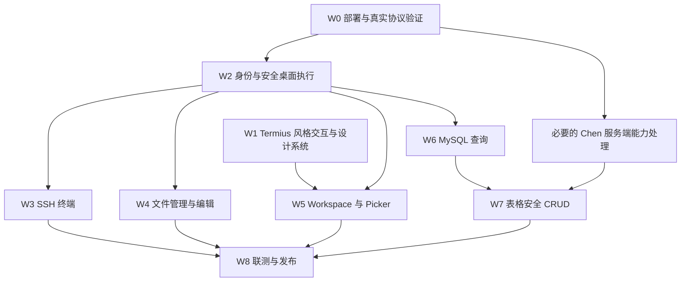

# JumpServer 社区版桌面工作台：实现分析与实施计划

**依据：** [产品需求与技术详细设计 v1.0](JumpServer_Community_Desktop_Design_v1.0.md)  
**页面参考：** Termius 官方产品截图、桌面导航、Workspaces、SFTP 文档。  
**原规划范围：** 实现分析、固定源码参照、页面方案、任务依赖与验收计划。后续桌面实现状态见下节；原规划的完整验收要求没有因此缩减。  
**证据边界：** 已执行客户端构建、协议测试、真实 Electron 界面和磁盘 Utility Process 烟雾验证，并以独立配置、本地 HTTPS/WebSocket 协议对端贯通资产、终端、传输与 Chen 查询。默认组织 ID 校验失败已有回归修复；隔离对端验证不等于目标部署的 SSH、远端文件写入、数据库写入及审计贯通验收。

## 当前代码与运行状态

### 启动与目录

```sh
pnpm install
pnpm dev                 # macOS 自动准备开发 .app；Main 监听重启 + Renderer 热更新
pnpm typecheck
pnpm test
pnpm build
pnpm start               # 运行生产构建
pnpm run pack            # 生成应用目录；macOS 显式禁用签名，不自动调用本机证书
```

macOS 开发登录不再要求反复运行 `pack`：

- `scripts/dev.mjs` 从已安装的 Electron 克隆独立外壳 `.cache/desktop-dev/JumpServer Desktop Dev.app`，使用开发 bundle ID `org.jumpserver.community.desktop.dev`、声明 `jms` 并做本地 ad-hoc 签名；不修改 `node_modules` 或正式版。首次准备后缓存复用，Electron 版本、路径、架构或启动脚本变化时自动重建。
- `pnpm dev` 启动此外壳并加载 `out-dev/` 与 Vite Renderer；`pnpm build`／`pack` 仍写入 `out/`，不会覆盖监听中的 Main／Preload。外壳不是独立发行包，脱离开发服务启动会提示运行 `pnpm dev` 后退出。
- 开发配置默认在 `~/Library/Application Support/JumpServer Desktop Dev/`，Chromium 状态在其 `Chromium/` 子目录；站点、偏好和加密 OAuth 记录与正式版隔离，不迁移或借用正式版登录。可用 `JMS_DEV_USER_DATA=/绝对路径 pnpm dev` 指定独立验证配置，用 `JMS_DEV_PORT=5184 pnpm dev` 避开默认 5173 端口。
- OAuth 仍走同一套系统浏览器、PKCE、state、issuer 校验和 safeStorage。回调仍是 `jms://auth/callback`，不要求服务端允许 HTTP loopback，也不绕过认证。开发版和正式版共享系统级 scheme；登录时若当前处理程序不是本应用，仍需原生确认才能切换，切回另一客户端时同样如此。
- Renderer 修改保留 HMR；Main 修改会替换 Electron 进程。开发模式的应用退出／Main 重启直接结束进程，不等待退出确认和异步连接清理，会中断连接、传输、未保存编辑及待处理授权。请勿在有未确认写入时修改 Main；已完成安全保存的登录可按正常 OAuth 恢复规则恢复。正式版退出流程不变。
- 本轮开发外壳针对 macOS。Windows／Linux 保留原 Electron 开发启动方式及独立开发目录；Linux 自定义协议回调仍需要打包安装。删除开发缓存可触发重新准备，不会删除开发配置；若准备被中断，按错误提示移除缓存中的 `preparing` 锁后重试。

- `apps/desktop/src/main/`：受信站点、隔离认证会话、IPC 命令校验、本地目录授权、连接路由与独立于标签可见性的 SessionRegistry。
- `apps/desktop/src/preload/`：有限命令桥和 MessagePort 事件订阅，不向页面暴露 Node 或凭据。
- `apps/desktop/src/renderer/`：Termius 风格工作区、全局 Picker、xterm.js、文件双栏、Monaco 和数据库界面。
- `apps/desktop/src/utility/`：真实 Electron Utility Process 的磁盘扫描、分块读写与 SHA-256；端口使用 `process.parentPort`。
- `packages/desktop-contract/`：客户端命令、资源上下文、事件与能力状态。
- `packages/adapters-jumpserver/`：Core、原生 SSH/SFTP、Chen 协议与身份偏好 SQLite 存储。Core/Chen 网络由 Main 的隔离 Chromium Session 承载，SSH/SFTP 由 Main 授权的 ssh2 连接承载；协议执行尚未整体迁入 Utility。

### 截图对齐后的桌面界面

- 按提供的 Termius 截图重建窗口层级：58px 顶部标签栏、212px 文字侧栏、主机卡片网格和 330px 连接详情栏。窗口默认 1440×900；主机支持网格与列表切换，窄窗口保留独立滚动。
- 右上角头像展示已配置的 JumpServer 站点，旁边 `+` 添加站点；切换已登录站点会关闭旧身份连接并重新认证。有连接、传输或未保存内容时先确认，取消保留工作区。
- `+` 标签打开居中的搜索与最近连接页；快速跳转按工作区、已打开标签、授权主机和命令分组，支持方向键、Enter、Esc、输入法组合输入及选中项滚动。
- 终端直接占满顶部标签下方的工作区，不再叠加资源侧栏和重复标题。独立 SFTP 标签提供等宽双栏：左侧默认直接打开本地 Home，也可切换远程；右侧在文件栏内选择主机、账号并连接，不再弹出全屏紫色选择器。终端工具栏的 SFTP 按钮打开可收起的快捷侧栏，重新核验当前资产／账号的文件权限后创建独立文件连接。数据库沿用统一配色。
- 本轮使用独立 Electron 配置和本地 HTTPS/WebSocket 对端检查主机、连接详情、站点选择、新标签、快速跳转、终端、SFTP 与数据库页面。完成收藏筛选、网格/列表切换、站点切换取消/确认、最近连接重连、终端输入输出、远端文本读取、Chen 查询结果及 1024×680 布局检查。截图保留于 `release/ui-preview/`；其中主机与数据为隔离验收数据，不代表目标部署实测。
- 文件页与终端快捷侧栏共用单远端浏览器、传输状态和 Monaco 编辑保护。关闭侧栏只隐藏，不丢失路径／草稿；切换端点或关闭终端时，未保存内容先确认，活动文件任务转入后台。授权本地目录不再依赖远端连接，但身份切换／注销仍撤销目录授权。
- SFTP 候选来自当前身份的授权资产列表，逐台读取授权连接方式与账号，最多 4 个并发检查；不依赖最近连接。Core 普通列表没有 `permed_protocols`，不能用缺失字段排除主机。全页不支持时继续扫描后续页；授权检查失败显式提示并可重试，不伪装成不支持；选中后重新核验授权。
- 本地路径显示规范化绝对路径，点击即可编辑，Enter 导航、Escape 取消；保留前进/后退历史。Home 内路径无需系统目录选择，输入范围外路径会打开系统目录授权，取消或失败不改变当前位置。传输仍使用 Main 的目录授权句柄和相对路径，不接受 Renderer 提供的绝对文件访问能力。
- 资产库保留 Core 列表的 `category/type`（含 `{value,label}` 形式）；主机使用青色终端图标，MySQL/数据库使用紫色底与金色数据库图标。列表上方提供全部/主机/数据库类别切换，筛选传给 Core，和搜索、收藏、分页组合；重复点击当前类别不清空列表。
- 复合搜索输入统一使用 `input-frame`：资产库、新标签、全局 Picker、终端、本地文件、SFTP 和表格搜索均由外框呈现焦点；内部 input/select 不再叠加边框、outline 或阴影。独立输入框仍保留自己的焦点反馈。
- 主机搜索不再因身份未就绪而禁用，登录前后均能聚焦并输入；未登录时仅保留本地搜索值，不请求授权资产。已登录仍使用原有防抖、类别／收藏组合过滤和清除行为；复合搜索外框不再使用包含多个可标记控件的 label。
- 数据库初次进入 active（含 StrictMode 重放）自动加载资源树；节点请求独立校验，并发展开不会互相覆盖。SQL 编辑器与结果区支持上下拖动和方向键/Home/End 调整高度；窄窗口搜索和分页控件自动换行。
- 可编辑单元格双击进入本地草稿，复制改为独立按钮。点击“保存更改…”打开居中确认弹窗，并排展示冻结的行标识、字段旧值→新值、SQL 与警告，不再展开主页面确认区。长内容独立滚动，底部操作始终可见；取消保留草稿，只有“确认并执行 SQL”才执行，提交期间禁止关闭和重复提交。
- 行草稿按 MySQL 完整字段类型渲染：数值使用不丢精度的文本输入，ENUM 下拉、SET 多选、DATE 日期选择、DATETIME/TIMESTAMP 日期与精确时间分开编辑，TEXT/JSON 多行。TIME 按可为负且超过 24 小时的时长处理；`tinyint(1)` 仍是整数，不把显示宽度推断为布尔。输入即时显示字段错误，非法值不能保留草稿；新增行遗漏必填列时不请求 SQL 预览。

### 设备设置、统一主题与语言

- 资产库左侧“设置”无需登录即可使用。设置先编辑本地草稿，“保存并应用”成功后统一生效；非法输入不能提交，保存期间禁用控件，恢复默认值仍需明确保存。主题、语言与编辑选项属于设备，不随注销或删除站点清除；收藏和最近连接继续按站点／用户隔离。旧版字号、字体、回滚设置一次性迁移到 `device_preferences`，不丢弃有效的收藏／最近连接。
- 终端可配置本机字体／自定义 CSS 字体列表、8–32px 字号、方块／下划线／竖线光标、闪烁、1–2 倍行高、100–200000 行回滚和选中复制。Main 使用固定版本 `font-list` 读取本机字体名称，非空成功结果缓存；读取失败或空列表可重试。Renderer 不获得任意文件读取或系统字体权限；macOS 原生枚举程序随包解包到 `app.asar.unpacked`。
- SQL 与远端文件／差异编辑器共用编辑字体、8–32px 字号和 2／4／8 空格缩进。文件与 SQL 自动换行分别配置；MySQL 另有 SQL 行号、50／100／200／500 行默认分页、10–24px 结果字号和舒适／紧凑行密度。默认分页只影响新打开的表，不隐式重新读取当前表或丢弃草稿。
- 统一主题同时驱动工作台 CSS 语义颜色、xterm ANSI 配色和 Monaco：JumpServer、Catppuccin Mocha、Dracula、Nord、Tokyo Night、Solarized Dark、Solarized Light、GitHub Light。“跟随系统”在 JumpServer 深色与 GitHub Light 之间响应系统变化。切换外观或编辑设置不重建现有终端／连接，不重放输入、执行 SQL 或清空已挂载草稿。
- 应用界面支持简体中文、English 与跟随系统；覆盖导航、Picker、终端、SFTP、数据库、设置及应用自有原生确认／文件对话框文案。账号、路径、SQL、结果值和未知服务端诊断保持原文；不承诺翻译第三方编辑器内建菜单或操作系统自有控件。新增文案使用各模块的中文键和英文词典，数字／日期通过共享格式化入口处理。
- 设置页采用标签在上、控件在下的双列表单，统一 36px 控件高度、分区间距和开关行，窄内容区收为单列；字体保持全宽。移除设置页重复的资产工具栏和底部悬浮保存栏，恢复默认／保存操作置于普通页头，站点区保留新增／编辑／删除。保存结果复用全局右下角 toast；失败保留草稿，恢复默认不自动持久化，待保存期间禁止重复提交。

### HeroUI 基础控件与 Termius 式外观

- 引入固定版本 HeroUI 3.2.5 和 Tailwind CSS 4.3.3，Renderer 独立编译组件样式。只加载已使用控件的结构样式，不加载 Tailwind preflight 或 HeroUI 默认配色；`heroui.css` 将组件颜色、边框、焦点和浮层映射到现有八套主题，保留顶部标签、文字侧栏及桌面工作区密度。组件库浮层表面与应用遮罩的同名 `overlay` 变量局部隔离，不覆盖终端或 Monaco 样式。
- 应用自有交互控件已覆盖全部 13 个 Renderer 页面／工作区模块：165 处 HeroUI Button，以及 Input、TextArea、Select／ListBox、ComboBox、Checkbox、Switch、Radio／RadioGroup。导航、会话操作、终端工具栏、本地／SFTP 文件、数据库查询与类型化编辑器均使用同一套控件；语义数据表格、xterm 和 Monaco 引擎保留。专用标签和文件行通过 Button 的 DOM `render` 回调保留原生角色、`aria-selected`、提示文字与拖放属性，避免 React Aria 对按钮无关属性的过滤；不增加通用透传包装器。
- 站点切换与传输任务使用 HeroUI Popover，任务监控仍为非模态；SFTP 位置菜单使用 Dropdown，Picker、站点编辑、文件操作、数据库 SQL 审阅和粘贴确认使用 Modal／AlertDialog。保留各流程原有的草稿、取消、条件保存、未知结果冻结、忙碌期间关闭限制和明确提交语义；通知队列／计时及业务状态不重写。数字、MySQL 精确值和日期仍保持字符串，不通过 JavaScript Number／Date 往返；空字符串枚举采用独立键，不与未选择或 NULL 混淆。
- 设置字体继续支持本机搜索、自定义 CSS 字体列表及空列表／失败重试，保存期间显式禁用控件及浮层选项。React Aria 无障碍文案跟随应用语言，不另建主题或语言状态。标准操作按钮使用 `.app-action`，不再与 HeroUI 自动添加的 `.button` 类冲突；专用行、标签和工具栏自行控制尺寸，避免库默认居中与缩放改变桌面布局。
- 浮层比例修复：HeroUI Modal 容器默认 `flex: 1` 不能作为卡片宽度边界，快速切换和多行粘贴现分别在 Dialog 本体限制为 680px／560px；站点、文件和 SQL 审阅维持 440px／460px／960px。清除默认 Dialog 内边距、纵向 Header 和额外正文间距的叠加；标题靠左、关闭按钮靠右。浮层使用实色表面与单边框，移除背景 blur、泛光阴影和缩放动画；输入框焦点仅改变单层边框。
- 字体选择修复：ComboBox 外框独占边框，字体预览保留为无边框文本，避免预览边框露在弹层上方形成双线。选项文字与勾选图标使用独立列，并同时清除图标的 `transform` 与独立 `translate`，长字体名截断而不覆盖图标。选项 `textValue` 使用原始 CSS 字体列表，显示用的“当前字体”前缀不进入输入值。

### 已实现和保留限制

| 工作流 | 当前代码行为 | 尚未完成的验收 |
| --- | --- | --- |
| 认证与授权资产 | HTTPS/网关子路径、系统浏览器 OAuth Authorization Code + PKCE S256、state／issuer 校验、系统安全存储恢复、到期前 60 秒单飞刷新；Core 401 仅自动重试 GET，连接 token POST 不重放。暂时失败保留身份，撤销／拒绝续期才重新认证 | 目标部署 OAuth provider、SSO／MFA、回调处理程序与两身份隔离仍需实测；客户端内审批／人脸挑战未实现。收藏过滤依赖 Core 支持 `id__in`，不支持时显式失败 |
| 连接方式与组件入口 | `protocol/component/type/value` 全链路核验；终端/文件选择 Core 启用的 `native` 方法，申请 token 后读取该 token 的 `client-url`，仅连接其中的 SSH 网关。绑定 token/资产/协议，校验并记录网关主机密钥。Chen 保留 MySQL `web_gui` 与 HTTPS smart endpoint | 目标 SSH 网关端口、主机密钥、组织权限及代理仍需实测；不再把 WebSocket 重定向推断为服务端必须升级，不再向 KoKo 发送 Core OAuth token |
| 组织 ID 兼容 | 接受 Core 内置的 `00000000-0000-0000-0000-000000000002` 等 UUID 形状标识，不要求 RFC 版本/变体位；非法路径形状仍拒绝 | 目标部署重新登录结果由实际连接确认 |
| 工作区与终端 | 标签、双窗格、Picker、ssh2 原生 PTY、stdout/stderr、确认字节窗口与背压、resize、终端搜索、多行粘贴确认；SSH/Telnet 目标均通过 Core 指定的 SSH 网关，不启动外部终端 | 本轮以真实 SSH 对端验证；目标部署审计、会话控制及长时间大流量仍需验收 |
| 文件与传输 | 原生 SFTP 列表/目录/重命名/删除、串行操作、目录上传、分块/哈希/取消；保留授权本地目录、双栏传输、磁盘暂存跨会话复制及双端任务所有权。新远端文件使用排他创建，本地下载排他提交；丢失写入确认保留“结果未知” | 不依赖 KoKo `transfer_*`。不提供跨重启续传、目录下载或远端目录复制；目录上传限制 32 个根、5,000 项。拒绝观察到的符号链接，但标准 SFTP 不提供原子 no-follow 保证 |
| 文件保存与编辑保护 | 5 MiB 内 UTF-8 文本使用 SHA-256 版本，保存前重新读取比较；冲突停止、不自动重试。截断/写入请求丢失确认时保留未知结果，草稿和进行中操作仍参与关闭保护 | 标准 SFTP 没有原子 compare-and-swap，检查与写入间存在竞态，界面在读取及保存后均提示；草稿不是持久化恢复，强制结束或确认丢弃会丢失 |
| 数据库 | Chen 资源树自动加载、查询/取消、可调高度工作区、分页及整表文本搜索；类型化草稿编辑及基础校验、客户端生成 SQL 的新增/更新/删除、字段差异及一次性 SQL 确认、联合主键与完整原值条件、逐条事务、冲突停止、部分提交报告和未知结果冻结 | 仅已验证的 MySQL InnoDB 基础表可更新/删除；无主键只允许新增，视图/查询结果/无无损表示的类型只读。目标部署 ACL、审计持久化及审批策略仍需实测；不宣称服务端结构化计划或原子批次 |

### OAuth 登录与恢复决定

- 当前采用 Core OAuth 登录、原生 SSH/SFTP 网关连接与独立 Chen session；此决定取代先前“仅支持 OAuth Bearer KoKo WebSocket”的方案。嵌入式 Cookie 登录不恢复，`sources/` 不修改。
- 对照官方 Client `v4.1.7` 的 OAuth 流程：发现固定 Core 元数据路由，授权使用随机 state、PKCE S256 和 `read write`。端点必须是同源精确 Core 路由；反向代理省略的网关前缀只补到这些已知端点，issuer 保留服务端原值用于回调校验。
- TLS 终止兼容：Core 通过 `request.is_secure()` 生成元数据，外部 HTTPS 经代理转发后可能公布同域 HTTP issuer／端点。只将元数据的 HTTP 协议提升后与配置站点的 origin、端口及已知路由核验；实际请求仍从配置 HTTPS 站点构造。issuer 原值仅作标识用于回调精确比较及加密保存，绝不作为请求目标；跨主机／端口、任意路径和带凭据地址仍拒绝。
- 回调固定为 Core 生产默认注册的 `jms://auth/callback`；不使用仅 DEBUG_DEV 默认允许的 HTTP loopback 回调。应用包声明 jms scheme，macOS 提前接收 open-url，其他平台通过 single-instance 转发；没有匹配的待处理 state 时忽略回调。若 jms 已由其他客户端处理，登录前请求用户确认切换，不静默接管。
- 只记住一个当前站点身份。完整 identity／OAuth 配置／access token／refresh token／到期时间由 Electron 44 异步 safeStorage 加密，凭据文件 0600、目录 0700，临时密文原子替换；SQLite 普通字段不存令牌。拒绝不可用的加密后端与 Linux basic_text／unknown，不落明文。保存失败会明确提示只能依赖当前内存登录。
- 每次 Core 请求先确保 token 新鲜，到期前 60 秒刷新；并发共享一次 refresh，未返回新 refresh token 时保留旧值。刷新与持久化均受取消信号和认证 epoch 约束，注销后的晚到响应不能恢复身份。普通窗口关闭仅释放连接并保留凭据；显式注销先删本地凭据，再尝试服务端 revoke。
- Core 暂时断网／503 不清除身份或既有组件连接；invalid_grant、明确认证拒绝或拒绝续期才清理身份并提示重新认证。组件断线／拒绝仅影响该连接，重连重新申请连接 token，不重放终端输入或 SQL。
- KoKo WebSocket Bearer 预检、JSON/二进制桥及专有 `transfer_*` 路线已移除。Core OAuth 仅用于同站点 HTTPS API；原生 SSH/SFTP 仅使用本次 Core `client-url` 的一次性网关凭据，Chen 仍不接收 Core access／refresh token。
- 依据：[官方 Client OAuth 服务](https://github.com/jumpserver/client/blob/v4.1.7/src-tauri/src/service/oauth.rs)、[Core OAuth 默认回调与 PKCE 配置](https://github.com/jumpserver/jumpserver/blob/v4.10.19/apps/jumpserver/settings/libs.py)、官方原生客户端参照 [J10–J11]。服务端的 token 有效期、SSO/MFA 与撤销策略仍具有最终决定权，不承诺永久免登录。

### 官方原生网关连接决定

- 保留内嵌工作台，不照搬官方启动外部应用的产品形态。终端/文件仅接受 KoKo `native` SSH/Telnet/SFTP 方法，方法值取自 Core；数据库仍是 Chen `web_gui`，不伪称原生数据库客户端。旧 KoKo `web` 最近连接被过滤，不清空站点、收藏或 Chen 最近连接。
- Core 创建连接 token 后，GET 其 `/api/v1/authentication/connection-token/{id}/client-url/`。严格解码 `jms://` 后的有界标准 base64 JSON，核验 version=2、asset.id、protocol、token.id、endpoint.host/port；忽略 command/file，不执行服务端字符串命令，不从资产地址推导或回退连接目标。
- 对照官方 Go launcher，SSH 用户名为 `JMS-<token.id>`，密码为 token.value。ssh2 仅做一次密码认证，不使用 agent、私钥或交互认证回退；Core OAuth 和资产密码不进入 SSH 连接配置。授权取消/注销关闭正在认证和已建立的连接，迟到响应不能恢复会话。
- 网关 SHA256 主机密钥按“站点 URL + host + port”记录。首次信任和密钥变化均需原生确认并建议独立核验；指纹格式与 OpenSSH 一致。`credentials/ssh-host-keys.json` 只保存公钥指纹，0600、原子写入并序列化读写；拒绝符号链接/损坏记录，失效连接的迟到确认不能建立信任。
- 依赖固定 `ssh2@1.17.0`、`@types/ssh2@1.15.6`。本机 Node 26 下 ssh2 可选原生 crypto 加速编译失败，使用其内置实现；Electron 原生 SSH/SFTP 运行与正式打包均已验证，不以可选加速的存在作为认证正确性条件。

### 客户端 SQL CRUD 决定与边界

- 用户明确批准仅修改桌面客户端，通过 Chen 现有 SQL 通道执行客户端生成的 DML。本决定取代此前“等待 Chen 结构化预览能力、保持 CRUD 禁用”的处置；不修改 `sources/`，不直连生产 MySQL、不绕过 Chen。
- 主进程保存不可变表快照和预览；预览绑定会话、架构/表、元数据指纹与完整原始行，5 分钟有效、仅消费一次。Renderer 只提交 `previewId`，无法替换已确认 SQL；编辑、重新读取和提交使旧计划失效。每批最多 100 条、SQL 总量最多 1 MB。
- 标识符引用、文本 UTF-8 十六进制编码；空字符串使用无转义歧义的空字面量，规避发行版 Druid 把 `X''` 改写成无效 `0x`。BIGINT/DECIMAL 不经 JavaScript Number；NULL、空字符串、DEFAULT 和省略字段分别处理。拒绝超出列精度的小数/时间及无法编码的 UTF-16。
- `desktop-contract/src/mysql-values.ts` 共用类型解析及新写入校验；Renderer 和 SQL 编译器使用同一规则，旧 ENUM/SET 原始快照仍可用于精确条件。检查整数范围、DECIMAL 精度/符号、浮点溢出、字符码点长度、选项成员、JSON/UTF-16、日历及小数秒精度、TIME/YEAR 范围；不自动改写数值或 JSON 文本。SET 含空成员时与空集合无法通过文本结果区分，拒绝可写快照；二进制/空间类型仍只读。
- UPDATE/DELETE 同时包含完整联合主键及每列原值，文本使用字节精确比较，避免不区分大小写/尾空格的排序规则掩盖并发修改。主键、生成列和自增列不能更新；生成/自增列新增时省略。无主键表仍可新增。
- 独立 Chen QueryConsole 执行写入。每条 DML 是完整独立的 ACL 输入，不隐藏在事务前缀后；前后核验连接 ID 与 autocommit，读取发行版固定格式影响行数，恰好 1 行才 COMMIT。冲突/错误回滚当前条并停止；之前已提交的条目不回滚。提交确认丢失、连接或事务模式改变时冻结写入，不重试。
- 这不是原子批次，也不保证触发器的非事务副作用、外部系统或自增序列可回滚。Chen 要求额外对话框/审批时仍失败关闭，客户端不自动批准。二进制/空间等未建立无损表示的列使整表只读。
- 表搜索使用 `db.table.search: { text, column? }`，按区分大小写的字面子串搜索全部支持列或指定列；最多 512 个 UTF-16 代码单元。输入不接受原始 WHERE，`%`/`_` 不是通配符；字段来自真实元数据，标识符引用和 UTF-8 十六进制文本编码复用 CRUD 实现。分页/清除/修改条件重建快照，切换条件先确认丢弃草稿，提交后按已应用条件刷新。
- [Chen v4.10.19 的 DataViewAction](https://github.com/jumpserver/chen/blob/v4.10.19/backend/framework/src/main/java/org/jumpserver/chen/framework/console/action/DataViewAction.java) 没有过滤动作。搜索先通过已有 `view_data` 授权，再由现有 QueryConsole 执行带 LIMIT/OFFSET 的安全 SELECT；有主键时按主键排序，无主键不承诺跨请求稳定行序。空搜索保留原生 DataView 路径，不修改服务端或直连生产数据库。

### 已执行验证

- `pnpm typecheck`、`pnpm run pack`：通过。`pnpm test`：15 个测试文件、104 项通过；保留 OAuth、SQL/Chen、原生传输、本地文件、表搜索与精确类型回归，并验证设备设置迁移、身份隔离、站点删除保留设备设置及非法保存不覆盖原值。构建仍有 Zod 依赖的纯注释标记告警，不影响产物生成；macOS arm64 产物未签名。
- HeroUI 全量迁移验收：`pnpm typecheck`、`pnpm run pack` 通过；结构化扫描 13 个交互模块，165 处 Button 均显式指定 type／variant，除 36 处受 HeroUI `render` 管理的原生按钮节点外，没有遗漏的普通原生表单控件。真实 Electron 隔离 IPC 夹具验证账号方向键选择、标签选中语义、Picker 焦点返回、非模态任务监控、数据库分页／文本搜索、精确 DECIMAL／空字符串 ENUM／SET 值进入冻结预览、取消保留草稿且 apply=0、重复确认仅 apply=1 且等待时 Escape 不关闭。文件多选和拖放载荷、双击打开、实际 Monaco 草稿取消保存后保留、确认保存原文、删除取消不调用 remove／请求中禁止关闭，以及终端搜索、多行粘贴取消不发送／明确确认只发送一次均通过。所有数据库、文件及终端写操作只作用于验收夹具，不代表生产链路验收。
- 全量外观与打包验收：八套主题逐一保存切换，1440×900 深色和 1024×680 浅色文件／SQL 确认窗口保持独立滚动、底部操作可见且无页面水平外溢。最终 macOS arm64 包从 `file://` 冷启动，sandbox 开启、设备主题保留；站点 Modal 内 Enter 提交和站点 Popover 实际可用。截图 `58-full-heroui-db-review.png` 至 `63-full-heroui-packaged.png` 保留于 `release/ui-preview/`。本轮未新增或重复运行后端测试；临时配置与 IPC 夹具在验收后清除，未签名应用产物保留。
- 浮层比例与平面外观修复验收：检查所有 Modal／AlertDialog 调用点；真实 Electron 隔离数据实际打开快速切换、添加站点、删除站点、文件新建目录、终端粘贴、数据库保存预览及 SFTP 离开连接确认。1440×900 深色与 1024×680 GitHub Light 下测量卡片宽度、标题／关闭按钮及底部操作位置；背景 blur 和卡片阴影均为 none。字体弹层只有 1px 边框、预览无边框，勾选图标与选项垂直中心相同，点击保留当前字体后 CSS 字体字符串不变。Picker 方向键选择及 Escape 关闭、站点 Escape 取消、SFTP 继续编辑保留 Monaco 草稿通过；本轮未发起数据库提交、远端文件写入、终端发送或连接关闭。截图 `64-flat-quick-switcher.png` 至 `75-flat-sftp-confirmation.png` 保留于 `release/ui-preview/`。
- 修复后的 `pnpm typecheck` 与 Renderer 生产构建通过。项目卷空间不足导致常规打包目录未完整生成，已删除该不完整产物；改用 `pnpm exec electron-builder --dir --publish never -c.mac.identity=null -c.directories.output=/tmp/jms-visual-fixed-package` 成功打包。最终未签名应用暂存于 `/tmp/jms-visual-fixed-package/mac-arm64/JumpServer Desktop.app`，已从 `file://` 冷启动并验证站点 Dialog 宽度 440px、Header 横向、输入框无叠加焦点环、sandbox 保持开启；`76-flat-packaged.png` 为该产物截图。本轮未重复运行后端测试，隔离配置与 IPC 夹具验收后清除。
- 主机搜索与设置重排验收：真实 Electron 隔离 IPC 数据下，原生点击与输入可聚焦主机搜索；登录后输入 Gateway 只发出一次防抖资产请求并筛出对应主机，清除恢复列表，未登录输入不发出资产请求。设置保存成功显示单个浮动 toast；延迟失败时控件和操作禁用、重复 Enter 不重复提交、失败草稿保留；恢复默认不触发保存。1440×900 深色与 1024×680 浅色／英文布局、字体弹层和全部 13 个表单控件通过视觉与尺寸检查，无底部保存栏或水平溢出。
- 本轮 `pnpm typecheck`、`pnpm build` 通过；项目卷空间不足，使用 electron-builder 将未签名 macOS arm64 应用输出至 `/tmp/jms-settings-reflow-package/mac-arm64/JumpServer Desktop.app`。打包版从 `file://` 冷启动，sandbox 开启，保存的语言与主题保留；实际验证未登录搜索聚焦和输入、设置页头及 1024×680 布局。截图 `77-settings-header.png` 至 `84-settings-packaged.png` 保留于 `release/ui-preview/`。本轮未重复运行后端测试；验收不代表生产 Core／SSH／Chen 链路测试，隔离配置和 IPC 夹具验收后清除。
- HeroUI 本轮验收：`pnpm typecheck`、`pnpm run pack` 通过。真实 Electron 独立配置验证下拉键盘选择、Escape 关闭并回到触发器、字体搜索选择与自定义列表失焦保留、空列表／失败后重试恢复 264 项本机字体、开关 Space 操作、非法字号禁止保存、待保存 Input／Select／Switch 全部禁用，以及站点表单 Enter 提交。八套主题通过设置保存切换，1440×900 深浅色与 1024×680 浮层无水平外溢；打包应用从 `file://` 冷启动后字体、字号、语言和主题保留，sandbox 开启且 Renderer 无 Node `require`。截图 `54-heroui-settings-dark.png` 至 `57-heroui-packaged.png` 位于 `release/ui-preview/`。本轮为控件 UI 变更，未新增或重复执行后端测试，不代表新增生产连接或数据库写入验收。
- 设置与主题验收：真实 Electron、独立用户目录，Main 字体与偏好命令真实执行，读取 264 个本机字体并搜索选择 JetBrainsMono Nerd Font Mono。真实 xterm 与 Monaco 搭配隔离会话数据验证 8 套主题、系统深浅切换、字体／光标／行高／换行／缩进／结果字体与密度；原终端实例、SQL 模型、单元格输入和文件草稿保留，设置保存未发起连接、目录／表重载或数据库写入。原生目录对话框的中英文标题通过实际命令与取消响应验证；字体空列表／失败重试、非法字号／字体、待保存控件禁用和 1024×680 无水平外溢通过。截图 `47-settings-catppuccin-en.png`、`50-settings-nord-compact-zh.png`、`51-settings-mysql-controls-zh.png` 位于 `release/ui-preview/`；本轮不新增生产 Core／SSH／Chen 写入验收。
- 打包与冷启动验收：最终 macOS arm64 `app.asar` 从 `file://` 启动，保持 sandbox／contextIsolation，Renderer 无 Node `require`。与独立开发实例共用本轮隔离配置冷启动后，全部设置逐字段一致，字体枚举仍返回 264 项；恢复默认值先只改草稿，保存后才覆盖全部设备设置。`53-settings-packaged-catppuccin-en.png` 为最终打包应用截图。隔离配置与运行夹具在验收后删除，保留截图和未签名应用产物。
- 本轮数据库桌面交互：真实 Electron、隔离 IPC 数据夹具，初始 active 会话在 StrictMode 下自动显示资源根；同时展开两个节点均显示子项并结束加载。双击只进入草稿且不改剪贴板；BIGINT/DECIMAL 原值、NULL、空字符串、DEFAULT 和省略值保持区别。取消保存及继续编辑均未调用 apply；核对字段差异和 SQL 后，明确确认仅调用一次，随后刷新保留搜索条件。搜索换页/每页条数、指定字段、脏草稿取消/确认、空结果清除、输入法组合 Enter 均验证通过。1024×680 下拖动使编辑器/结果高度反向变化，方向键与 Home 可用；全部六个已有复合搜索及新增表搜索的内部 border=0、outline=none，外框保留焦点。截图：`39-db-save-review.png`、`40-db-resizable-search-compact.png`、`41-sftp-single-focus-border.png`，位于 `release/ui-preview/`。
- 保存确认弹窗验收：真实 Electron 隔离 IPC 夹具，弹窗打开前后结果区高度均为 497px，未展开主页面详情。取消、Esc、关闭按钮和遮罩均保留草稿且 apply 调用为 0；Tab/Shift+Tab 限制在弹窗内，关闭恢复保存按钮焦点，弹窗期间全局 Picker 快捷键不穿透。1024×680 下长 SQL 正文可独立滚动，底部按钮保持可见且无水平外溢；过期可重新生成并再次确认。明确提交仅调用一次，等待期间禁止关闭，成功后关闭弹窗并刷新；确认响应丢失时关闭弹窗、保留未知报告及草稿并冻结写入。`pnpm typecheck`、`pnpm build` 通过；此轮为 UI 变更，未新增或重复执行后端测试。截图 `42-db-save-modal.png`、`43-db-save-modal-compact.png` 位于 `release/ui-preview/`，不是生产写入验收。
- 类型化编辑器验收：真实 Electron 隔离 IPC 夹具，整数溢出、负无符号小数、越界 TIME、错误 JSON 和过长 Unicode 文本均留在编辑器内并显示字段错误，未调用预览或提交；改正后 UINT64、DECIMAL(30,9)、六位小数秒和大整数 JSON 原文准确进入冻结预览。ENUM 引号/逗号/空字符串、SET 多选及重新打开、DATE 日期控件、BOOLEAN 与 tinyint(1) 区别、TEXT 多行、NULL/DEFAULT/空字符串/省略列、必填新增列及 IME Enter 均验证。1440×900、1024×680 视觉检查通过；紧凑窗口可调整结果高度以完整显示编辑框。截图 `44-db-typed-integer-validation.png`、`45-db-typed-datetime.png`、`46-db-typed-compact-validation.png` 位于 `release/ui-preview/`，本次桌面验收 apply 调用为 0。
- 类型校验实际 SQL 验证：独立 MySQL 8.0 容器读取真实元数据和原始行，当前编译器拒绝五类非法写入；生成的 UPDATE 实际执行后，UINT64 最大值、DECIMAL(30,9)、带引号 ENUM、SET、四个补充平面字符、微秒日期时间和负时长逐字段精确回读，大整数 JSON 数字保持完整。确认 TIME 极限不能带非零小数、YEAR 范围以及 SET 空成员与空集合文本相同但位值不同；隔离服务及临时脚本已清除。此轮不代表新增生产 Chen/Core 或 Druid 链路验收。
- 本轮表搜索实际 SQL 验证：独立 MySQL 8.0 容器，搜索匹配记录分页为 50/50/20，跨页 ID 顺序正确；BIGINT/DECIMAL 无精度损失。包含 `%`、`_`、引号、反斜杠及 Unicode 的注入形状文本只匹配自身，普通模式及 `NO_BACKSLASH_ESCAPES` 均通过，181 条夹具记录完整；真实元数据和搜索结果可建立可编辑快照并生成未执行的更新预览。本轮 UI 写入只更新 IPC 夹具，不代表新增生产 Chen/Core 或 Druid 解析链路验收。
- 文件导航界面验收：实际 Electron 使用隔离身份/资产/会话响应夹具，本地文件命令仍由真实 Main 执行。零最近连接、普通列表协议为空、前 30 台资产都不支持 SFTP 时，仍发现后续页 8 台可用主机；授权失败重试、过期搜索结果丢弃、账号连接拒绝后重试、返回保留远程路径、左栏选择主机后返回本地均通过。真实 Home 自动打开且无目录弹窗；绝对/相对路径、前进/后退、错误不跳转及范围外授权取消通过。类别切换及重复点击通过；1440×900 和 1024×680 视觉检查通过。截图为 `release/ui-preview/35-inline-sftp-picker.png` 至 `38-inline-sftp-compact.png`。本轮夹具会话不代表新增生产网关验收。
- 原生网关实际运行：隔离 Electron 工作台使用 Core/OAuth 响应夹具，经真实 macOS `jms://` 回调登录，连接真实 ssh2 SSH/SFTP 对端；拒绝首次主机密钥后未建立会话，确认后原生 PTY/stdout/stderr/输入/resize 及快捷 SFTP 可用。5 次 native client-url 授权、0 次 KoKo WebSocket 请求，已信任网关的后续连接不重复提示。
- 原生文件验证：目录与文本操作、保存后旧哈希冲突拒绝、目录上传、2 MiB 二进制上传/下载（SHA-256 一致）、跨会话复制、同名排他拒绝及取消清理通过；对端退出后终端/文件标为 lost，Core 身份仍有效。实际终端键盘输入和 SFTP 面板截图：`release/ui-preview/33-native-ssh-terminal.png`、`34-native-sftp-panel.png`。`pnpm run pack` 通过。夹具中的 Core、浏览器启动和主机密钥确认不代表生产网关已验收，目标部署首次连接仍需操作员核验指纹。
- 下述早期 KoKo WebSocket/Bearer 记录保留为历史证据，已被本轮原生 SSH/SFTP 实现取代，不作为当前兼容性承诺。
- OAuth 真实运行：最终 `app.asar` 的 Main／Preload／Renderer 在隔离 Electron 44 配置下连接带 `/gateway` 的 HTTPS Core/OAuth 对端与独立 WSS KoKo 对端。真实 safeStorage 生成 0600 密文（无明文身份／端点），正常关闭后两次冷启动均恢复身份且浏览器调用数为 0；新授权携带原始 issuer 回调也可恢复。6 个并发 Core 401 只刷新一次；503 保留身份与活动终端，旧 KoKo 重定向明确拒绝且保留 Core，invalid_grant 删除凭据并显示重新认证提示，显式注销删除密文且到达 revoke 端点。
- OAuth UI 验收：实际指针完成站点配置、登录、账号选择、KoKo 终端连接及取消待处理授权；终端显示 Bearer 认证后的输出，取消后的晚到回调不能恢复身份。1440×900 与 1024×680 截图检查通过，紧凑页无水平外溢，提示／取消按钮可见；证据 `release/ui-preview/29-oauth-terminal.png`、`30-oauth-reauth-compact.png`、`31-oauth-pending-compact.png`。包装器仅信任该本地证书，替代系统浏览器启动／OS 回调投递并核验后模拟组件许可，不更改系统 jms 默认处理程序；这不是生产 Core/KoKo、真实 SSO/MFA 或人工系统协议切换验收。`pnpm run pack` 通过，产物仍为未签名 macOS arm64 应用。
- OAuth HTTP 元数据修复：读取目标站点公开 discovery 响应，确认 HTTPS 入口公布同域 HTTP issuer 和三个端点；对应回归先复现完全相同的 `OAuth issuer is not a safe HTTPS URL`。修复后直接运行 discovery／授权 URL 构造通过，发现请求和全部可请求端点均为 HTTPS；回归覆盖原始 HTTP iss 回调、加密记录恢复后刷新，以及异域／端口／路径拒绝。本轮未发起目标站点用户授权或换取真实 token，不代表完整登录已验收。
- macOS 开发外壳：真实 `pnpm dev` 首次准备、缓存启动、Renderer HMR（一次更新且页面标记保留）及 Main 监听重启通过；新旧进程切换后调试端口可重新连接。使用隔离配置与 OAuth 响应夹具，经真实 `/usr/bin/open -a` 投递 `jms://`，完成 state／PKCE 换码与身份建立；Main 重启后读取真实 safeStorage 密文恢复，浏览器调用数为 0。拒绝协议切换时注册／浏览器调用均为 0；未调用系统默认处理程序切换 API。此验证不是生产 OAuth／SSO／MFA 或人工协议切换验收。
- 浏览器真实回调转义修复：目标站点浏览器确认“打开”后，macOS `open-url` 收到 `/callback`，但参数名为 `code`／`amp;state`，导致待处理 state 无法匹配。回调入口现仅还原 query 分隔符的一层 `&amp;`，不解码参数值；state 唯一性/匹配及 issuer/PKCE 校验不变。回归先失败后通过。之后目标站点 Core 登录、连接 token 创建与 Chen 资源请求已成功；旧 KoKo WebSocket 请求仍重定向，故本轮改为原生连接路线，不把该重定向等同于确定的版本不支持。
- SQL CRUD 真实数据库验收：MySQL 8.0.44、Connector/J 8.4.0 和 Chen 固定 Druid `1.2.28-jms-chen.1`。隔离 HTTPS/WSS 协议对端复现 `v4.10.19` QueryConsole 状态/日志，实际 JDBC 执行生成 SQL；联合主键、UINT64 最大值、DECIMAL(30,9)、含大整数 JSON、微秒时间、NULL/空字符串/默认值、新增/删除均通过。
- 真实故障验收：外部连接修改大小写及尾空格后，原值条件返回 0 行，当前条回滚且后续新增不执行；唯一约束失败保留前条提交、回滚当前条并停止。JDBC COMMIT 完成后断开确认通道，数据库已改变而客户端返回 unknown，预览不能重放；模拟 ACL 探测改变事务模式同样冻结。MyISAM/视图拒绝写入，无主键重复行不影响新增。
- 真实桌面验收：最终 `app.asar` 页面/Preload 经隔离 IPC 包装器使用当前 Main 连接与 Chen 适配器，通过 Chromium HTTPS/WSS 操作上述真实库。指针/键盘完成更新、新增（DEFAULT/NULL）、删除、确认预览、成功刷新、未知状态冻结及预览校验失败恢复；1440×900 与 1024×680 布局可用，紧凑页面无水平外溢。截图 `20-sql-crud-preview.png` 至 `23-sql-crud-compact.png` 位于 `release/ui-preview/`。这不是完整 Chen/Core 部署或生产审计持久化验收。
- Chen NULL 与错误恢复：以发行版所用 Gson 2.10.1 实际执行验证，默认序列化会省略 Map 中的 NULL 值；结果按 `fields` 声明将省略单元格解码为 NULL，不再误报 `column_default` 缺失。结果转换先于查询终结，失败也必定拒绝等待中的请求并释放操作锁；非法实际值仍拒绝，下一条查询／表操作可继续。打包页面通过隔离 Chromium HTTPS/WSS 对端验证 NULL 表元数据、转换错误后继续查询、协议断线后在新标签重连且不重放 SQL、提交确认丢失保留未知报告／草稿、已确认提交后刷新断线仍保留已提交报告。断线清除忙状态并提供重连入口；1024×680 下错误、重连和可滚动报告不重叠、无水平外溢。截图 `24-chen-null-table.png` 至 `28-chen-recovery-compact.png` 位于 `release/ui-preview/`；不是目标 JumpServer 部署实测。
- 连接令牌兼容：按 Core 模型接受 `from_ticket: null`，表示没有审批工单；回归先复现 Zod 空值错误，再验证已激活空工单令牌可用，非法工单类型仍拒绝，待审批、人脸验证和未激活令牌仍阻止连接。该验证覆盖客户端解析，不替代目标部署终端连接验收。
- 数据库连接方式：目标部署同一 MySQL 资产按顺序返回 `web_cli`、`web_gui`，旧按钮仅匹配协议而误选前者。按钮、发起连接校验和最近连接现同时匹配协议与连接方式；真实界面点击已越过原先的 Chen 方式校验，后续请求遇到 401 并触发现有登录失效清理，未完成目标数据库连接验收。
- Chen 初始化兼容：按官方前端时序，在主 WebSocket 收到 `set_ready` 后才加载 Profile；Chen `v4.10.19` 的拦截器要求会话已激活，旧顺序会在此之前请求 Profile。协议回归先复现 401 和未处理 Promise 拒绝，再验证查询／表格结果、受控确认拒绝及鉴权失效关闭；主会话就绪 Promise 仅在握手开始时创建，并与连接打开一起等待。目标部署仍需重新登录后确认连接结果。
- Chen 树节点空值兼容：官方 `TreeNode.meta` 在根节点等未赋值时可为 `null`，客户端现接受该空值，其他字段校验保持不变。协议回归先复现 `[0, "meta"]` 错误，再覆盖根节点／架构的空元数据、目录的对象元数据与表节点省略元数据，贯通会话打开、树展开、查询和表格读取。重新打包后使用独立配置启动 `app.asar`，确认生产页面与 bootstrap IPC 正常；未关闭现有用户实例，也未使用其登录会话验证目标数据库。
- Chen 控制台发行版契约：`v4.10.19` 的 `AbstractConsole.onInit` 只发送 `{title}`，`consoleId` 是较新开发提交的附加字段。适配器不消费 consoleId，现移除对它的必填要求，保留 title 校验；查询和表浏览共用该修正。回归样本改为发行版 title-only 消息，先精确复现用户报告的 `consoleId: undefined` 协议错误，再验证会话打开、查询精确值与表格读取全部通过。[J14]
- Chen 前端完整读链路核对：以 `v4.10.19` 的 `Tree.vue`、`QueryConsole/index.vue`／`ResultBar.vue`、`DataView/index.vue`／`DataView.vue` 与同标签 Java 实现交叉核对，不再用开发工作树 DTO 代表发行版。发行版 `UpdateDataView` 只有 `{title,data}`，查询和表格都按 title 路由；移除必填 id 及未消费的元数据校验，仍要求 title、fields、data 和实际消费的列类型。查询失败识别 `message.type=error`／`log.level=0`，等父控制台 `inQuery=false` 后拒绝，不依赖发行版不存在的 executionStatus／sql_error。初始表读取错误不再被后续空数据覆盖为成功。[J15]
- Chen 前端动作与时序：树展开回传缓存的原始节点，table 按前端视作叶子；打开表先调用 `/resources/actions/do` 的 `view_data`，服从服务端资源动作校验，再使用响应 nodeKey 建立控制台。分页按子视图 title 区分状态，等待新数据和 loading=false；普通提示不会终止读取，close 消息终止等待。长 SQL 按官方 `sqlChunkProtocol.js` 使用 4096 字符分块和完成消息。现有单结果集接口仍显式拒绝多个结果集，发行版缺少明确取消确认时不宣称取消成功。CRUD 开放方式见上方新决定。
- Chen 验证证据：先精确复现用户的 `id: undefined` 错误，再用无 id／consoleId／executionStatus 的发行版结构覆盖查询、表格和失败路径。另以真实回环 HTTP/WebSocket 执行长 Unicode SQL（3 块）、错误 SQL、无结果集语句与表格第 1／2 页，全部通过；这是依据发行版源码构造的本地协议对端，不是生产抓包或目标数据库实测。`pnpm typecheck`、`pnpm test`、`pnpm run pack` 均通过，更新 `release/mac-arm64/JumpServer Desktop.app`。
- 数据库复制权限：在隔离配置下运行真实 Electron 数据库页面，点击单元格精确复现 `Failed to execute 'writeText' on 'Clipboard': Write permission denied.`；主进程日志显示 `clipboard-sanitized-write` 被原来的全拒绝处理器拒绝。现同时设置 permission check/request，仅允许当前受信工作台主 frame、匹配页面 URL 的剪贴板写入，读取及其他权限仍拒绝。依据 [Electron 44.3.0 Session 权限接口](https://github.com/electron/electron/blob/v44.3.0/docs/api/session.md#sessetpermissionrequesthandlerhandler)。
- 早期剪贴板与能力提示验证（CRUD 禁用状态已由上方新决定取代）：打包的 `app.asar` 中点击精确整数 `9007199254740993` 和 NULL 单元格，使用 Electron 主进程异步 clipboard API 核对系统剪贴板，两次均匹配；主页面读取和聚焦子 frame 写入仍返回 NotAllowedError。检查 1440×900 页面和 1024×680 说明布局；当时使用临时 IPC 数据样本，不连接目标数据库。类型检查、40 项既有回归及桌面打包通过。
- 数据库树与宽度控制：schema／folder 使用目录图标，每个非叶节点仅保留一个展开箭头，表叶节点不显示展开箭头。资源侧栏默认 230px，支持拖拽、左右键（10px）、Shift＋左右键（50px）、Home／End；范围为 150px 至工作区宽度一半，最大 520px。宽度仅保留于当前组件，不新增持久化设置。工作台固定为 `minmax(0, 1fr)` 列，避免 Monaco 旧宽度挤出操作按钮；按工作台容器宽度切换紧凑布局。
- 表浏览路由修复：`/chen/api/resources/actions/do` 的 POST 已补入 Main 精确白名单，同时覆盖首次请求与 Chromium 请求守卫。回归先复现“请求不属于此连接允许的组件路由”，再验证请求可到达服务端资源动作校验；其他路径／方法、跨连接令牌、组织及入口仍被拒绝，没有放开 `/chen/api/*` 通配路由。
- 本轮真实运行：最终 `app.asar` 的页面及 Preload 在隔离 Electron 配置下，通过临时 IPC 驱动当前 Chen 适配器与组件连接实现，实际经过 Chromium HTTPS/WSS、本地带 `/gateway` 前缀的协议对端打开表。收到 BIGINT `9007199254740993`、DECIMAL `1234567890.123456789`、NULL；实际指针拖拽 230→390px、左方向键调整、Home／End 和窗口缩小时 520→512px 均通过。1440×900、1024×680 截图检查通过，紧凑布局工作区无水平外溢；证据见 `release/ui-preview/18-database-resize.png`、`19-database-compact.png`。这些是隔离协议验收，不是生产 Core 认证或目标数据库实测。
- R-D02 处置更新：保留“只能修改桌面客户端”的约束，按用户后续批准实现 SQL CRUD。客户端功能及隔离真实 MySQL 验收已完成；不再因缺少结构化 API 统一拒绝 `db.preview`/`db.apply`。目标 JumpServer 的 ACL/审计/审批端到端验收仍未完成，不等同于下文完整发布门槛通过。
- 智能端点真实运行：生产 Electron 页面经带 `/gateway` 前缀的 Core 对端登录，终端与快捷 SFTP 被路由到独立 KoKo 端口，显示终端输出并接受输入，文件列表显示 `endpoint.txt`。两个 Chen 会话分别连接不同 HTTPS 端口，并发查询返回各自端口标识；关闭其中一个后，另一个仍可查询。
- 历史 Cookie 路线的隔离与注销证据（已由上述 Core OAuth 与原生网关决定取代，不再作为当前认证兼容承诺）：当时对端记录 4 次 smart endpoint 请求、6 条 WebSocket，KoKo 收到所选 jms_sessionid，Chen 收到自己的 JSESSIONID；伪造组件被拒绝，注销关闭全部连接。当前 SSH/SFTP 不传递 Core Cookie 或 OAuth token，以本轮原生网关验证为准。
- `pnpm build`：Main、Preload、磁盘 Worker 与 Renderer 均构建成功；依赖中的 Zod PURE 注释触发 Rollup 注释警告，不影响构建。
- 真实 Electron 窗口：添加/保存 HTTPS 站点、拒绝 HTTP、未登录资产空态、Picker 搜索设置命令与 Enter 执行、设置页和传输抽屉；1440×940 无页面外溢，Renderer 无 `require`。
- 独立 Electron 配置 + 本地自签名 HTTPS/WebSocket 对端：默认组织登录、225 项资产的第二页加载、跨页收藏授权筛选与搜索交集、KoKo 终端二进制输出。测试包装器仅信任该本地证书指纹，未向产品加入 TLS 绕过。
- 真实文件传输路径：1 MiB 下载逐字节一致；两个上传排队时取消其中一个，下载与另一个上传成功，被取消文件未提交。关闭标签仍保持连接；重新打开复用同一会话；后台最后一项结束后连接被释放，任务结果保留。
- 真实编辑界面：Monaco 文件草稿取消关闭后保留，连接丢失后仍保留；仅剩断线文件会话时原生关闭被拦截，“继续工作”保留窗口。Chen HTTP/会话/Console 对端返回精确 DECIMAL 字符串，SQL 草稿取消关闭后与查询结果一同保留。生产 CSS 下可见和隐藏终端高度均受约束，切换标签后不再持续发送 resize。
- 真实 Utility Process：600,000 字节分 3 个不超过 256 KiB 的块读取，完整 SHA-256 相符；扫描不跟随符号链接，读取拒绝符号链接；下载完成前不发布目标文件，取消清理暂存文件。
- 双栏与快捷侧栏：在生产构建中通过真实 IPC、HTTPS/WebSocket 与磁盘 Worker 验证 701,113 字节上传、900,123 字节下载／远端复制的 SHA-256；目录拖入上传和远端拖回本地的内容一致。同会话不同路径复制不死锁，同路径与已存在本地目标拒绝覆盖。两端均切换离开后，600,001 字节复制继续完成并释放两端连接。
- 终端快捷 SFTP 独立使用当前账号重新授权，收起再展开保持同一会话；上传／下载内容一致。Monaco 草稿阻止终端关闭和端点切换，取消确认后保留，条件保存收到服务器确认。关闭终端时，仍在传输的快捷文件连接先转后台，下载完成后自动释放；取消复制后的迟到帧不再触发原生异常，暂存目录已清理。双栏和快捷侧栏均检查 1440×900 与 1024×720 布局。
- 生产资源以 `file://` 启动通过；Main 独立拒绝 HTTP IPC 请求。`pnpm run pack` 以 `-c.mac.identity=null` 生成 macOS arm64 未签名应用目录，避免自动选择本机签名证书；`dist` 保留独立的正式签名配置。未执行公证或发布。

这些结果不等价于目标 JumpServer 兼容认证，也不替代下文 G0、R-D02、审计、跨平台签名和性能验收。没有在参考服务端工作树中修改或部署代码。

## 1. 结论与需要调整的实施顺序

### 1.1 协议能力须核验；SQL CRUD 采用已批准的客户端方案

采用 **Electron + React + TypeScript + xterm.js + Monaco**；Glide Data Grid 进入首批交互验证。客户端自研页面和工作流，不嵌入官方工作台，不通过外部 SSH/MySQL 工具完成核心任务。

不能把原设计的接口草案直接当作现成协议，也不能把文档引用的开发提交当作发行版能力：

- KoKo `v4.10.19` 已有结构化 SFTP 的基本浏览、上传、下载、删除、重命名、建目录；不是只能走 elFinder。设计引用提交中的 `save`、`expected_version`、`transfer_*` 是相对该标签的后续变化。
- Chen `v4.10.19` 的 `DataViewConsole` 有表浏览及查询动作，但没有设计引用的结构化预览/保存链路。`SaveChangesRequest` 和 `datasource/edit/` 在比较中属于新增代码。
- 设计引用的 Chen 开发提交仍返回 `COMPOSITE_PRIMARY_KEY_NOT_SUPPORTED`，且其 UPDATE/DELETE 谓词只包含单个主键。不能依赖该结构化路径满足联合主键和原值保护；当前改由客户端生成完整谓词，经发行版已有 SQL 通道执行。[J03–J07]

**实施决定：** 认证、文件与数据库继续按真实协议验收。数据库采用上方已批准的客户端 SQL CRUD，明确逐条事务、部分提交与未知状态边界，不要求部署 Chen 结构化预览扩展；目标环境权限/审计和完整发布门槛仍须另行验收。

### 1.2 对原设计的六项落实与修正

| 原设计方向 | 本计划的落实 |
| --- | --- |
| 按能力接入 | 分开保存“静态参考能力”和“真实部署验证能力”；只有后者可成为正式兼容承诺 |
| 自研完整客户端 | 参考 Luna 现有桌面连接流程，但不把其 Nuxt/Vue 页面、外部应用启动和非目标功能整体搬入 |
| Utility 承担执行 | 协议解析、会话、磁盘流、查询任务放 Utility；认证网络传输的落点在 G0 根据 Electron 锁定版本实测确定 |
| 多模块单仓库 | 先建一个桌面应用和三个共享包；UI 领域保留清晰目录，不预先拆成十几个独立发布包 |
| W4 依赖终端上下文 | 文件与终端共同依赖资源/账号上下文，不要求先完成整个终端模块才能开发文件 |
| 先终端，再完善数据库 | SSH/SFTP 与 Chen 验证同步推进，禁止最后才发现数据库写入不满足要求 |

## 2. 已落地的源码参照

### 2.1 本地目录与固定版本

| 目录 | 当前工作树提交 | 用途 | 比较参照 |
| --- | --- | --- | --- |
| `sources/jumpserver/` | `38fd77583aa6805fc19007354c27846d52d0225e` | Core 发行版认证、授权、连接令牌 | 同当前工作树 |
| `sources/luna/` | `bb02a9846a8a3f21ce6bc84c9187fdb961b20cfb` | 原设计固定提交；Web/桌面调用顺序 | `5a7a9a70bd7cdd77fde1753af58a80f3918b14ab` |
| `sources/koko/` | `cb06f265992dd3ea4173432c028d50cfbf96b2f1` | 原设计固定提交；终端、文件协议 | `1a6befc9c75d1e1726787d7635fa2aee2593ab05` |
| `sources/chen/` | `d9890760dfdf87595bcaf6ca388fd96892f8f12f` | 原设计固定提交；查询、表格写入 | `86abab892e34b67327dc97331d99af7c9c08e45d` |
| `sources/client/` | `d0741ef1a6aa36f95a1e2a6ab99653bd1def212a`（`v4.1.7`） | 官方独立 Client：账号、连接方式、令牌与本地应用启动 | 拉取时 `dev`：`7b03884d54994600391fda1ab1717f2da43aea28` |

完整来源清单见 [sources/reference-manifest.json](sources/reference-manifest.json)。Luna、KoKo、Chen 的比较标签均为 `v4.10.19`，工作树仍保留设计指定提交。2026-09-14 新增官方 Client，工作树固定在 `v4.1.7`，保留拉取时 `dev` 提交作为比较参照。Client 与服务端版本号独立，**这个混合参考集合不是经验证的服务端部署组合。**

`v4.10.19` 来自本次读取的官方发布记录，作为具体发行标签比较，不推断它是所有用户应该安装的版本。[J00]

### 2.2 已执行的比较方法

本轮实际执行了以下类型的源码调查；这些不是目标部署测试：

```sh
# 当前工作树与发行标签的真实提交
 git -C sources/chen show --no-patch --format='%H%n%cI%n%s' HEAD v4.10.19

# 结构化 CRUD 是否存在于发行标签
 git -C sources/chen diff --name-status v4.10.19 HEAD -- backend/framework/src/main/java/org/jumpserver/chen/framework/datasource/edit backend/framework/src/main/java/org/jumpserver/chen/framework/console/entity/request/SaveChangesRequest.java backend/framework/src/main/java/org/jumpserver/chen/framework/console/DataViewConsole.java

# 直接读发行标签的文件处理与表浏览实现
 git -C sources/koko show v4.10.19:pkg/httpd/websftp.go
 git -C sources/chen show v4.10.19:backend/framework/src/main/java/org/jumpserver/chen/framework/console/DataViewConsole.java

# 对照新增文件协议与既有桌面接入
 git -C sources/koko diff v4.10.19 HEAD -- pkg/httpd/websftp.go pkg/httpd/webrouter.go
 git -C sources/luna diff --stat v4.10.19 HEAD -- electron ui/composables/useApiRequest.ts packages/connectors-core LICENSE
```

结果：Chen 所选比较范围共 48 个变更文件，`SaveChangesRequest` 及 `datasource/edit/` 下文件为新增；KoKo `websftp.go` 中新增条件保存和传输动作；Luna 固定提交已包含 Electron 桌面目录和连接共享代码。协议参考不必只停留在 Web 前端。

### 2.3 使用源码的边界

- `sources/` 仅用于研究，不作为应用运行依赖、不进入安装包；未来应用构建和格式化范围必须排除它。
- Core、KoKo、Chen 的所读根 LICENSE 为 GNU GPL v3。Luna 固定提交的根 LICENSE 为 MIT，且相对比较标签发生了变化；Client `v4.1.7` 根 LICENSE 为 MIT。根文件的观察不代表每个文件、嵌入二进制、插件及其历史来源均获得同样授权。
- 优先独立实现协议与产品工作流；确需复制代码时逐文件确认来源、许可证和通知义务，不因根 LICENSE 改动自行推断历史代码可任意再分发。
- 不把开发提交整套替换到生产环境，不在本轮修改这些参考工作树。

### 2.4 官方独立 Client 的真实连接链路

2026-09-14 拉取 [jumpserver/client](https://github.com/jumpserver/client)，固定到 `v4.1.7`。结论：**该版本的主要职责是连接编排和本地应用启动，不是本项目所需的内嵌 KoKo 终端／Chen 数据库工作台。** 它的 Tauri 前端、Rust 请求层和仓库内 `go-client/` 必须连起来读，不能只看 UI 或资源目录中的可执行文件。[J10][J11]

```text
资产 + 授权账号 + Core 连接方式
  → Tauri get_connect_token（刷新 API 认证上下文）
  → POST /api/v1/authentication/connection-token/
  → GET /api/v1/authentication/connection-token/{id}/client-url/
  → jms://Base64(JSON)
  → Rust pull_up 启动资源目录中的 JumpServerClient
  → Go launcher 解码 protocol / endpoint / token / file
  → 按协议和本机配置启动终端、SFTP、RDP/VNC 或数据库应用
```

- **连接方式不是协议的别名。** `useConnectMethods.ts:92-110` 从 Core 返回值中选启用的 `native` 方式并排除 `_guide`；HTTP 选 `applet`。`useAssetAction.ts:225-243` 优先使用当前可用选择／默认值，也存在请求失败后的硬编码回退。本项目应参考服务端选择规则，不照搬该回退来绕过授权核验。
- **账号与令牌分工明确。** 托管账号提交 account ID；手动、同名、匿名账号分别使用 `@INPUT`、`@USER`、`@ANON`，按模式提交 `input_username` / `input_secret`。Rust 创建 token 后仅提取 ID，再向 Core 获取启动 URL；不是从资产资料中提取真实密码直接连接。[J10]
- **原生连接的入口地址由 Core 决定。** Core 的 `get_client_protocol_data` 根据连接方式的 `endpoint_protocol`、资产及 endpoint 规则选择入口，写入 JSON 的 `endpoint.host/port`；Go 使用这些地址。SSH/SFTP/Telnet 用户名是 `JMS-<token.id>`，数据库使用 token ID，凭据为 token value。不能把资产 IP 当作等价连接目标。[J02][J11]
- **本地工具负责实际协议会话。** `go-client/pkg/awaken/awaken.go:280-299` 分派 RDP、VNC、SSH/SFTP/Telnet 和数据库；macOS 的 `awaken_darwin.go:74-209` 通过 `osascript` 或 `exec.Command` 启动配置应用，数据库可调用 mysql、psql、redis-cli 等命令或外部 GUI。无需因此把本项目改成外部工具启动器。
- **启动成功不等于连接就绪。** `client_launcher.rs:222-267` 检查短时间 stderr 和子进程退出状态，约两秒后仍运行也返回成功；这里没有证明目标协议已认证、可输入或可查询的握手。该返回不能用作内嵌会话的 ready，也不能作为远程断开状态的依据。
- **不复制其凭据传递和日志策略。** 所读实现把启动 URL 写入日志，并把 token value 放入部分命令参数／脚本；Base64 不是加密。此类 URL、命令和凭据不应进入本项目 Renderer、诊断日志或持久化连接记录。[J10][J11]

### 2.5 与 Luna 内嵌路线及当前代码的对照

本项目保持内嵌工作台路线；官方 Client 提供 Core 原生授权与网关凭据参照，终端/文件使用标准 SSH/SFTP，**Luna + Chen 仍提供内嵌数据库连接的协议参照**。Luna 的固定提交已经含 Electron／内嵌连接实现，不应仅按旧版网页客户端理解。[J12]

| 环节 | 官方证据 | 当前实现与判断 |
| --- | --- | --- |
| 连接方式身份 | Luna 保留 `value/type/component/endpoint_protocol/origin_value`；本地注入方式先映射回服务端原始方式，再申请 token | `core/schemas.ts` 现保留 component/type 与 endpointProtocol；ResourceContext 以 `{value,component,type}` 表示方式。Main 对当前 Core 授权选项重新核验完整身份，Renderer／最近连接／快捷 SFTP 均已迁移；没有引入本地方式别名 |
| 组件入口选择 | Luna 申请 token 后调用 `/api/v1/terminal/endpoints/smart/`，传 endpoint protocol、asset ID、token ID，再按 Chen／KoKo／Lion 生成入口；Electron 另有组件 endpoint 解析 | Chen 保留 smart endpoint、HTTPS 入口与绑定连接的网络容器；终端/文件改为本次 token 的 `client-url`，只连接其中经核验的 SSH 网关。任何入口与凭据均不进入 Renderer |
| 数据库会话建立 | Chen auth 交换 → 绑定 cookie 与 Chen token 的主 WebSocket → 服务端就绪 → 元数据／console | 当前 Chen 已在主通道 `set_ready` 后读 profile，并接受树节点 `meta:null`。这些修正与协议参照一致；不应改成官方独立 Client 的 `db_client`／外部数据库程序 |
| WebSocket 认证 | KoKo WebSocket 还需要登录身份，单独的连接 token 不足以通过 HTTP middleware；Chen token 使用子协议并绑定独立 HTTP session | KoKo WebSocket 路线已移除，不再向其发送 OAuth access token。Chen 每个连接使用新的内存 Session，在 `/auth` 建立自己的 Cookie；HTTP 与 WS 共用此容器，Origin 使用组件 origin，HTTP 重定向及跨入口 WS 请求被拒绝。[J13] |
| 版本边界 | Client `v4.1.7` Go launcher 与 Core `v4.10.19` 所读路径是 `jms://`；Luna 固定提交的外部启动分支检查 `jms2://` | 当前只解析已核对的 `jms://`、version 2 原生载荷，校验 token/资产/协议与网关地址；不执行其中的 command/file，也不尝试猜测其他版本 |

Luna 的 smart endpoint 调用见 `useAssetAction.ts:288-336,615-647` 和 `useApiRequest.ts:531-553`。其中 **Web Proxy 分支**另行创建 KoKo connect-ticket；不要把该要求误套到所有普通 KoKo／Chen 连接上。`onSessionReady` 在部分分支只是向工作区交付 token／endpoint，也不能替代组件适配器的真实握手。[J12]

**本次修改与剩余验收：**

1. 已保留连接方式身份，并同时迁移 Main、Renderer、快捷 SFTP 与最近连接。旧版 string 方式及旧 KoKo Web recent 不猜测替代方式，加载时丢弃；有效 native/Chen recent、字体、滚动缓冲与收藏等其他设置保留，实时 IPC 不接受旧契约。
2. AdapterHost 分为 `authorize → AuthorizedConnection`（Chen）与 `authorizeNative → AuthorizedSshConnection`（终端/文件）。授权绑定 token、入口、组织和认证 epoch；适配器在失败／关闭／注销时释放，迟到的授权结果不得恢复会话。Chen 组件 origin 授权与 SSH 主机密钥信任分开管理，两条链路不共享凭据容器。
3. 既有 `from_ticket:null`、`TreeNode.meta:null` 和 Chen ready 顺序修复保留；控制台与数据视图按发行版前端使用 title，不把开发提交附加的 consoleId／id 当作必填。查询错误、资源动作、表格状态和 SQL 分块按同标签前后端核对；保留安全边界和实际消费字段的校验，没有新增客户端内审批／人脸挑战实现。
4. 目标部署仍须按 Core／KoKo／Chen 实际 tag、digest、SSH 网关端口与路由配置验收。原生文件链路不再依赖 KoKo WebSocket 的 upload／`transfer_*` 版本差异；标准 SFTP 的非原子版本检查与符号链接竞态仍须明确，不把本地对端通过等同于生产兼容性。

源码来源记录在 manifest，关键文件固定链接见 J10–J15。验证包括既有 Chen 发行版消息、隔离 Core 响应夹具、真实 SSH/SFTP 对端与 Electron 交互，结果见“已执行验证”；没有运行官方 Client 连接真实资产，也没有新增目标生产原生网关兼容性结论。

## 3. 协议可行性与源码差距

### 3.1 Core：登录、身份和连接许可

实际调用关系应封装成一个授权连接流程，而不是由各页面拼接口：

```text
配置受信站点
  → 完成该部署支持的登录/MFA/重定向
  → 读取用户身份与组织上下文
  → 查询当前用户授权资产、账号、连接方式
  → 申请具体资产连接令牌
  → 处理审批/确认等挑战
  → 解析受信组件端点
  → 按 profile 申请 KoKo 票据或交换 Chen 会话
```

源码参考与实现要求：

- Luna Web 请求使用 Cookie、mutation 的 CSRF header 和 `X-JMS-ORG`。组织来自已认证上下文，不用网上示例 UUID。[J01]
- Core 路由需要组合父前缀。例如 `authentication/urls/api_urls.py` 中的 `auth/` 实际位于 `/api/v1/authentication/auth/`，不能漏掉 `/authentication/`。用户体验优先复用登录页面的真实认证流程，不自造万能账号密码表单。[J02]
- 连接令牌会受 ACL 审批、账号和连接方式校验影响；`exchange` 生成新连接令牌，不等同于重新发送旧 token。账号返回可能有别名等表达，不能把所有字符串都当作不可变数据库 ID。
- Luna 固定提交已经实现桌面 OAuth discovery、authorization code + PKCE、state 校验，以及 `createKokoConnectTicket`。这是系统浏览器接入的具体参考，但不能推断目标部署启用了该 OAuth provider 或允许本应用回调。[J09]
- Renderer 只得到身份摘要、资源引用、挑战状态和会话句柄。Cookie、Bearer、连接 token secret、Chen token 不进入通用 UI Store、SQLite 普通字段或日志。

**G0 必验：** 登录成功后真实身份、两用户隔离、组织请求、审批接受/拒绝、token 过期、网关子路径、端点重定向和账号选择。失败不自动切到管理员身份或不受支持的认证方式。

### 3.2 KoKo 网关：原生 SSH 与 SFTP

| 能力 | `v4.10.19` 已核对情况 | 设计固定提交情况 | 桌面实现决定 |
| --- | --- | --- | --- |
| 文件基本动作 | WebSocket `list/download/upload/rm/rename/mkdir` 存在 | 保留并扩展 | 当前改用标准 SFTP，不解析 shell 输出 |
| 条件保存 | 所读分发没有 `save` | `expected_version`、临时文件、二次检查、替换 | 当前在 SFTP 保存前比较 SHA-256；冲突停止，不宣称原子 CAS |
| 传输 prepare/status/commit | 所读分发没有这些动作 | 有 `transfer_*` 及阶段文件 | 当前不使用这些动作；SFTP 分块流、排他创建与取消，不提供跨重启续传 |
| elFinder | 兼容路线 | 仍有相关路由 | 当前不使用，也不作为自动降级入口 |

关键工程事项：

1. 终端使用经 Main 授权的 ssh2 连接申请 PTY，处理输入、resize、stdout/stderr、关闭和丢失状态；输入不自动重放，不复用文件会话。
2. 文件会话独立申请原生 SFTP 授权；业务动作直接映射到 SFTP，不再保留 KoKo JSON/二进制桥、wire id 或协议 profile。
3. 同一文件会话串行执行操作；上传使用排他创建，下载通过磁盘 Worker 排他提交。写入确认丢失保留未知结果，不自动重试可能已生效的修改。
4. **版本检查不等于原子条件替换：** 保存前读取并比较 SHA-256，但标准 SFTP 没有条件写入；其他写入者仍可能在检查后修改。界面在读取与保存后持续提示，检测到冲突一定停止。
5. 单文件传输使用有界流；目录上传拆为数量/深度受限的文件任务，不提供目录下载或远程目录复制。拒绝观察到的符号链接及其祖先，但不声称标准 SFTP 提供原子 no-follow。
6. stdout/stderr 共用确认字节预算，SSH channel 在硬上限前暂停；MessagePort、磁盘流和 UI 消费均保留上限。跨会话文件复制经受保护的本地磁盘暂存，不在内存聚合整文件。
7. 终端和文件共享资产/账号上下文，不共享“终端执行过 sudo”的状态。关闭文件面板不取消已确认后台任务；注销使该身份所有通道停止接收新工作。

### 3.3 Chen：不能只实现一个 SQL 编辑器

真实接入需要：

```text
Core 数据库连接令牌
  → 组件 /api/auth（网关通常映射为 /chen/api/auth）
  → Chen token + 对应 HTTP session
  → /ws/session 主会话
  → /ws/console 查询或 data_view 控制台
  → 元数据、查询、预览/提交、消息和取消
```

固定提交还注册了 `/ws/db-console`；是否使用由实际连接流程决定，不为每个标签无条件打开所有通道。握手会检查 Origin、子协议中的 token，以及创建 token 时的 HTTP session 绑定；HTTP API 成功不意味着 WS 一定成功。[J08]

**已具备的实现基础，均限于设计固定提交：**

- `data_view_action` 下有 `save_changes_preview`、`save_changes`，对应 `save_changes_preview_result`、`save_changes_result`。
- 请求包含 `schema/table/changes/insertRows/deleteRows`；单元格 NULL 有独立布尔字段；更新/删除采用单个 `pkColumn/pkValue`，并可使用掩码主键的服务端 `rowRef`。
- 服务端构造参数化 DML，具有事务执行、ACL/审计与提交失败进入未知状态的处理。应参考这些实现，不重新走一条缺乏审计的直连路径。
- 读取归一化会把 `BigDecimal` 转为十进制字符串，把 `Long/BigInteger` 转为字符串；这只证明对应代码路径存在，仍须核对实际序列化、MySQL 类型和 UI 回写。[J06]

**原设计要求与缺口：**

| 要求 | 固定提交证据 | 处置 |
| --- | --- | --- |
| 联合主键 | 明确拒绝 `COMPOSITE_PRIMARY_KEY_NOT_SUPPORTED` | 需要可信服务端实现完整原始键向量；不能只取第一个键 |
| 原始行冲突检测 | 请求没有完整原始行快照；DML WHERE 只有单主键 | 服务端保存/验证行快照或可靠版本，短事务内检测；客户端二次查询不能替代 |
| 服务端预览计划绑定 | 所读请求没有本项目 `PreviewRef/schemaRevision` 契约 | 客户端预览失效控制先实现；可信计划引用是单独服务端契约，不能伪造官方支持 |
| NULL、DEFAULT、遗漏字段 | 所读 CellValue 是 value + valueIsNull | 插入可用遗漏字段；无法表达的 DEFAULT 操作必须明确禁用或扩展，不能发送字符串表达式 |
| 精确值贯通 | 读写已有字符串和 JDBC codec 支持 | UI 从首次解码起保留字符串；按字段元数据区分文本/数值，验证 unsigned BIGINT、JSON 大数与微秒时间 |
| 可靠终态 | 返回多个数据库/审计字段，事务实现保留 commit unknown | Adapter 显式映射结果，不把单个 success=false 当作已回滚 |

**本项目服务端必要工作包（若无已验证等价版本）：** 在 Chen 内完成复合主键、可信行快照/结构版本、短事务内冲突检测、受控预览计划、类型化写入及结果状态；保留现有 ACL、审批和审计。提交结果未知仍禁止自动重试，operationId 本身不提供 exactly-once。

这些是拟议实现，不是已存在的官方协议。不在业务表偷偷加版本列，不通过 SQL 控制台拼接一串 `BEGIN/UPDATE/COMMIT` 冒充可参数化、可绑定连接的安全保存通道。

## 4. Termius 参考如何落到页面

### 4.1 借鉴结构与工作流，不复制品牌或信任模型

已查看官方 Hosts、Focus mode、Split view 图片。Termius 的官方资料明确说明横向标签与资源数据分离、工作区聚焦/分屏、桌面双栏 SFTP，以及同一主机终端与文件间切换。[U01–U04]

| Termius 参考 | 本项目落实 | 明确不照搬 |
| --- | --- | --- |
| Groups + Hosts，深色分层、圆角容器 | 授权资产分组、收藏、最近访问；卡片/紧凑列表切换 | 不显示可自由新增任意直连主机的主按钮 |
| 横向标签、减少侧栏干扰 | 工作标签常驻；资源栏可收起 | 不把正在运行会话和全部资源塞进同一无限列表 |
| Focus / Split | 同一工作区切换聚焦视图与分屏树 | 不因视图切换重新创建会话 |
| Command Palette | 全局 Picker 搜资产、已有标签、路径、库表、命令 | 不照抄快捷键；以原设计的平台键位与终端语义为准 |
| 双栏 SFTP、拖放、路径输入 | 左侧本地授权目录或已授权远程，右侧已授权远程；支持普通文件跨端传输和终端快捷侧栏 | 不绕过 JumpServer 直连第二远程；远端复制走两个独立授权的原生 SFTP 会话，经受保护本地暂存中转 |
| 远程文件编辑回传 | 内置 Monaco、差异预览、冲突处理 | 不以唤起外部编辑器代替本项目内置编辑要求 |
| 工作区模板和广播 | 只恢复布局与资源引用；广播默认关闭 | 不恢复执行命令，不采集完整输入历史，不复制云端 Vault/Keychain |

数据库页面沿用同一设计语言，但其元数据树、结果和编辑状态是本项目设计，不声称 Termius 提供本设计的 MySQL GUI。

### 4.2 工作台框架

保持原设计的 48px 导航、240px 可调侧栏、36px 标签、40px 上下文和24px状态栏作为初始值。1024px 以下优先收起资源栏；这些是拟定尺寸，不是已经实测的布局结论。

```text
┌─────────────────────────────────────────────────────────────────────┐
│ 站点/身份入口        资产 │ 故障排查工作区 │ app.users │ nginx.conf  + │
├────┬────────────────┬───────────────────────────────────────────────┤
│资产│ 收藏 / 最近     │ 生产 · web-01 · deploy · SSH · 已连接           │
│文件│ 授权节点树      ├──────────────────────────────┬────────────────┤
│数据│ 或当前库表树    │                              │ 当前资产文件   │
│任务│                │ 终端 / 聚焦与分屏            │ 可收起         │
│    │                │                              │                │
│设置│                ├──────────────────────────────┴────────────────┤
│    │                │ 任务抽屉：传输、查询状态、错误与取消确认        │
├────┴────────────────┴───────────────────────────────────────────────┤
│ 当前焦点对象 / 连接状态 / 编码 / 活动任务摘要                         │
└─────────────────────────────────────────────────────────────────────┘
```

资产首页的卡片是实际资源，不是统计仪表盘；进入会话后内容区域最大化。生产环境必须有文字徽标；账号/真实地址可见，不能只有别名或颜色。

视觉采用原设计深色令牌，优先做一致的选中态、焦点环、禁用原因、hover、菜单和文本层级。容器圆角可较柔和，终端和数据网格保持紧凑。资产类型图标不伪造操作系统探测结果。系统字体与等宽终端字体分开，普通文本按 4.5:1 目标实测对比度。

### 4.3 页面清单与操作闭环

| 页面/浮层 | 主要内容 | 必须可走通的动作与失败状态 |
| --- | --- | --- |
| 站点与登录 | 受信入口、登录状态、证书/代理诊断 | 登录、MFA、审批、过期；没有“忽略证书错误”捷径 |
| 资产页 | 节点/收藏/最近、搜索、卡片/列表 | 选择授权账号和方式；缓存已失效时重新授权 |
| 终端工作区 | 横向标签、分屏、搜索、焦点、文件侧栏 | 输入法、粘贴预览、发送中断、重连；不重放输入 |
| 完整文件页 | 本地/远程双栏、面包屑、属性、任务区 | 浏览、拖入、下载、建目录、重命名、删除；路径与冲突明确 |
| 文件编辑页 | Monaco、编码、未保存标记、差异 | 保存中再次编辑、冲突三方比较、save-unknown后重新读取 |
| 数据库工作区 | 库表树、SQL标签、表编辑标签、结果/消息 | 查询、取消、分页；任意结果与可编辑基础表视觉分离 |
| 数据变更预览 | 目标上下文、增改删计数、列差异、风险 | 编辑使预览失效；提交后区分成功/回滚/未知/刷新失败 |
| 全局 Picker | 分组结果、完整资源上下文、禁用原因 | 键盘选择、IME保护、旧搜索结果失效、关闭后还原焦点 |
| 任务/设置/诊断 | 按身份的后台任务、快捷键、兼容能力 | 面板关闭继续任务；注销停止；诊断不含正文和凭据 |

**第一轮体验评审不是只看首页：** 同时展示正常态、空态、无权限、连接中、连接丢失、未保存、冲突、结果未知，并走完原设计的四条用户任务。

## 5. 工程结构与 Module 职责

### 5.1 建议目录

以下目录是拟建结构，本轮没有生成应用脚手架：

```text
apps/desktop/
  src/
    main/                  # 窗口、AuthBroker、系统授权、存储密钥、更新
    preload/               # 白名单控制 Interface、受限 MessagePort 交付
    utility/               # SessionManager、传输/查询执行、文件流、配额
    renderer/
      app/                 # 页面组合与入口
      workspace/           # 标签、pane、分屏、焦点与布局
      assets/              # 授权资源浏览、账号选择
      terminal/            # xterm registry、输入策略、输出消费
      files/               # 双栏视图、编辑会话、任务展示
      database/            # SQL/表格编辑、结果、变更集
      command-center/      # 命令注册表、Picker providers
      ui/                  # 视觉令牌与共享控件
packages/
  domain/                  # 精确值、状态转换、资源作用域、变更集
  desktop-contract/        # IPC schemas、受限句柄与事件
  adapters-jumpserver/
    core/ ssh/ chen/ profiles/
tests/
  contract/ fixtures/ compatibility/ e2e/ fault/
sources/                   # 参考仓库，排除打包和应用质量命令
```

依赖方向：Renderer 使用 domain 与 desktop-contract，不导入 Electron、文件系统或协议 Adapter；Adapter 不依赖 React；Main/Utility 组合执行能力。页面不出现 KoKo/Chen 版本分支。

### 5.2 收敛到少量深 Module

| Module | 对外 Interface（拟议内部契约） | 隐藏的 Implementation 与不变量 |
| --- | --- | --- |
| AuthBroker | 登录/注销、身份摘要、授权连接意图 | OAuth PKCE、安全存储、单飞刷新、组织、审批、端点许可、连接令牌；拒绝任意 URL 代理 |
| SessionManager | open/close/observe、受限数据通道 | generation、引用、终态、限额、认证失效、进程崩溃；不自动重放 |
| FileEngine | 浏览/修改目录项、传输任务、编辑保存 | 本地授权句柄、远端路径、流、临时文件、校验、取消、结果未知 |
| DatabaseEngine | 查询/取消、打开表、预览/应用变更 | Chen 通道、类型、元数据、服务端计划映射、事务结果；不隐去不支持字段 |
| Workspace | 布局变更、视图激活、关闭决策 | tab/pane/session 的关系、焦点、稳定编辑器实例；隐藏不销毁 |
| CommandCenter | 搜索、命令可用性与执行 | providers、排序、取消、键位作用域、明确执行目标；全部入口同一规则 |

Seam 放在真正变化的地方：进程通信、服务端协议、操作系统文件授权。先实现首个真实 profile，不做插件框架、通用 ORM 式 API 或“未来任何堡垒机”的抽象层。

### 5.3 先固定四个契约

1. **Scope：** 站点（含部署 base path）+ 已验证用户 + 组织 + 资源/账号引用。UI 传入身份字段只能做一致性校验。
2. **SessionRef：** sessionId + generation。重新授权/重连后新代际，晚到响应不能更新新对象。
3. **OperationResult：** 未开始、未改变、已改变、未知；数据库提交、刷新和审计结果分开。写入超时不等于失败可重试。
4. **Capability：** supported/unsupported/unknown + 来源/限制/证据。静态源码报告不能被当作部署 supported。

RPC 使用 discriminated union 或逐命令 schema，不接受 Renderer 任意 `method/url/path`。大文件块和终端输出不进入 React Store；批量数据通道也必须验证代际、帧大小与速率，不能因为已建 MessagePort 就信任所有消息。

### 5.4 tab、pane 与底层连接分开

标签承载一个工作视图或工作区，pane 是布局中的显示位置，session 是连接。移动和聚焦只改 view/pane 映射；分屏可放入已有会话或由用户明确新建连接。

一个 xterm 实例只能挂载在一个实际 DOM 容器中；不要同时把相同实例挂到两个 pane。首版不做同一连接的多份可输入镜像。Monaco model 由 registry 持有，隐藏标签不销毁，关闭对象后按引用释放。

## 6. 关键实现方案

### 6.1 桌面与网络

构建建议采用 pnpm workspace、electron-vite 与单一打包链；electron-vite 官方有 React/TypeScript 模板，支持 Main/Preload/Renderer 构建。[E04] 依赖和运行时版本在 G0 的实际可运行组合上锁定，不直接执行未审查的 latest 模板作为正式基线。

当前认证采用系统浏览器 OAuth，不创建嵌入式登录窗口或持久化 Core Cookie jar。Main 为 Core 和每个 Chen 连接建立独立内存 partition；原生 SSH/SFTP 每次授权创建独立 SSH Client。只在身份确认后安全保存 OAuth 记录，正常退出可恢复。加密草稿尚未实现，不与记住 OAuth 身份混为一项能力。

**已锁定网络实现：** Core/Chen 使用 Electron 44 Session.fetch 与 net.WebSocket，绑定 HTTPS/WSS 入口、组织与授权 epoch；SSH/SFTP 使用 ssh2 的原生加密传输，绑定 Core client-url 与已核验主机密钥，不发送 Core Bearer。Utility 负责有界磁盘读写与暂存，主进程不启动外部 SSH 程序或直连目标资产。[E01–E02、J10–J11] 私有 CA、网关端口、代理及目标部署仍须独立验收。

Origin 取经过批准的应用接入 profile；不利用服务端 localhost/空 Origin 放行规则绕过策略。每次重定向、智能端点结果都重新检查允许列表和部署 base path。

MessagePort 通过 Electron 的 `postMessage` 系列交付，不能把普通 `invoke` 当作端口传输。[E03] 端口建立后仍需有界队列、注销撤销和 Utility 崩溃处理；不宣称零拷贝。

### 6.2 终端、工作空间与 Picker

- xterm registry 持有稳定实例；使用官方适配、搜索等插件。resize 等布局稳定后计算，按行列去重；渲染加速失败有可用回退。
- 输出以有界队列和 xterm 完成回调控制消费。没有服务端背压保证时，达到风险阈值明确断开，不悄悄丢输出。
- 输入使用 xterm 编码；Ctrl+C/S/Q 保留终端语义。多行粘贴先预览；片段只插入，不自动回车。
- 远端标题、文件名、SQL单元格全部作为数据；链接按协议和目标校验；OSC 剪贴板受权限策略控制。
- Picker 先返回已打开标签、收藏、最近和已缓存授权资产，再补远程结果；每次新输入废弃旧请求。表搜索先覆盖当前已连接 MySQL 元数据，不为了全局搜索偷偷打开所有数据库。
- CommandRegistry 统一菜单、快捷键、右键和 Picker。执行时捕获明确上下文，不读取异步过程中可能改变的全局当前资产。
- IME composition 期间 Enter 不执行命令/SQL/结果选择；Esc 先关闭浮层，返回发起控件。

### 6.3 文件引擎与编辑器

- 本地/远程面板共享展示模型，但不共享路径拼接或安全策略。本地路径从用户授权句柄派生，远端路径按远端语义处理。
- Task journal 保存任务元数据，不保存文件正文。文件按块流式处理，限并发、限队列；服务器完成确认后才标完成。
- 冲突策略为询问、跳过、明确替换或保留两者，按服务器可保证能力启用；旧上传失败不自动覆盖重试。
- 编辑大小上限取客户端初始 5 MiB、管理员限制和服务端限制中的最小值；无法可靠解码或二进制只读。
- editorVersion、提交的内容版本与保存中的后续编辑分开；旧保存响应不能把较新的本地编辑清成 clean。
- 冲突时保留基线/远端/本地三份内容；确认丢失进入 save-unknown，重新读取比较，不自动重复保存。
- 对缺乏可靠条件写的关键文件，默认只读/下载编辑或要求服务端增强。不是通过免责文案把无提示覆盖变成可接受。

### 6.4 查询与安全 CRUD

- 查询标签与表编辑标签分开；首版只开放明确来源的基础表写回。JOIN、聚合、无可靠行定位一律不自动写回。
- SQL 编辑器本地元数据补全；不通过正则判断语句无副作用，不按字符串分号拆任意脚本，不给任意 SQL 尾部加 LIMIT。
- 表浏览先使用该 profile 已支持的分页/排序；默认 200 行，设备设置可选 50／100／200／500 行，当前已打开表保留其分页；稳定排序并附加主键。keyset 是后续在真实协议和索引条件下启用的能力，不预先承诺任意跳页。
- 数据从首次接收就使用精确类型模型：整数/DECIMAL 为字符串，NULL 独立，时间保留原始精度和会话时区，JSON 不经可能损失大数的解析再回写。
- ChangeSet 使用原始完整主键；新增、修改、删除、撤销/重做留在本地，先预览再提交。预览后编辑、结构刷新、代际改变使计划失效。
- 客户端 SQL CRUD 用独立不可变快照和 SQL 编码表示 DEFAULT、复合键与原值条件，不依赖发行版缺失的结构化提交 DTO。每条 DML 经 Chen ACL/审计独立执行；元数据或值不能无损映射时拒绝写入。
- 取消有独立请求和状态；关闭标签/WS 不是取消成功。提交已成功但刷新失败只重试读；unknown 冻结写入重试。

### 6.5 存储、安全与发布

SQLite 保存站点、设备通用设置与身份作用域的收藏／最近连接，普通库不存凭据、终端内容、文件正文或数据库结果。设备设置在未登录时仍可读取／保存，恢复默认值不清除身份数据。OAuth 恢复记录保存在系统密钥库保护的密文文件中；安全存储不可用时明确提示不能保证重启恢复，不明文降级。布局、能力、任务及加密草稿的持久化不由这一实现自动具备。[E05]

严格 CSP、contextIsolation、sandbox、禁用 nodeIntegration；不关闭 webSecurity。编辑器资源随包交付，诊断默认只记脱敏状态和关联 ID。签名、离线安装、迁移和可回退升级都属于 W8，进行中的写入不能被静默更新打断。

## 7. 开发依赖与工作包

### 7.1 依赖关系



W0 内用临时最小客户端验证链路，不等待 W2 产品化才证明可行性。W1 与 W0 可以同步；W3/W4/W5/W6 在共享契约确定后并行。服务端能力处理的含义是验证已有等价版本，或完成获批扩展；当前所核对两个 Chen 版本不能直接满足全部要求。

### 7.2 可直接拆为 issue 的工作包

| 工作包 | 实施内容与产物 | 依赖 | 退出门槛 |
| --- | --- | --- | --- |
| W0 接入基线 | 目标版本/digest、认证与网络 profile、普通账号、脱敏消息；SSH/SFTP/查询/单行写入调查；复合键与冲突能力报告 | 管理员提供隔离环境与权限 | 核心路径有真实证据；服务端缺口有明确、可执行且获批的处置方案 |
| W1 交互设计 | 资产、终端、双栏文件、编辑器、数据库、Picker；正常/失败/未知状态 | 原设计，本计划 | 四条用户任务走查；不以首页截图代替工作流 |
| W2 安全执行基础 | AuthBroker、scope、IPC schema、MessagePort、SessionManager、存储与诊断；确定唯一网络桥 | W0 协议/网络结论 | 真实认证贯通、无任意URL/路径桥、注销隔离、Utility崩溃安全 |
| W3 终端 | wire codec、授权/初始化、xterm registry、输入/resize/关闭、背压 | W2，W1 的交互契约 | T-T01–T-T03、T-W01 对真实 SSH 通过 |
| W4 文件 | list/stat映射、目录操作、上传下载、流式队列、文本编辑、冲突与未知结果 | W2，共享资源上下文 | T-F01–T-F04、T-E01–T-E02；权限/完成语义与兼容声明一致 |
| W5 工作空间与 Picker | 标签/pane/分屏/焦点、Provider、命令与快捷键、作用域缓存 | W1、W2 | T-P01–T-P02、T-W01–T-W02；切换不重连、搜索不串身份 |
| W6 查询 | Chen认证/主通道/控制台、元数据、SQL模型、执行/取消/分页/结果 | W2，W0 Chen结论 | T-D01，精确类型读链路先过；取消终态可解释 |
| W7 安全 CRUD | 精确值、变更集、预览、复合主键、冲突、事务/审计结果映射；必要服务端工作 | W6，服务端等价能力 | T-D02–T-D08 对真实库通过；不能以单PK演示宣布完成 |
| W8 联测发行 | 混合负载、故障与安全、签名、安装升级、迁移回退、兼容清单 | W3–W7 | 全部 R/T 与发布阻塞条件检查通过 |

建议责任分配为工作台交互、桌面/协议、数据库/服务端、测试/安全四条执行线，产品与管理员提供决策和环境。人员可兼任；未确认环境与服务端缺口前不报固定交付日期，G0 后再按实际工作包估算。

### 7.3 第一批具体开发任务

这些是下一阶段的开发任务，本轮未执行：

| 顺序 | 任务 | 可检查的产物 |
| --- | --- | --- |
| 1 | 记录目标 Core/KoKo/Chen、网关、认证、账号权限和 MySQL 范围 | 非秘密 deployment profile；服务端变更许可单独记录 |
| 2 | 走通官方登录/SSH/SFTP/数据库流程，收集脱敏请求与消息 | 每条链路握手和终态样本，附审计关联 |
| 3 | 运行隔离 Electron Session 的 HTTP/WS 小实验 | Cookie/CSRF/Origin/代理/CA 结果；锁定一条网络实现 |
| 4 | 在隔离表核对单PK、联合PK、并发编辑、精确值、提交断线 | CRUD能力/缺口结论；决定等价版本或Chen扩展，不做客户端绕过 |
| 5 | 初始化一个桌面应用与三共享包，定义四契约和权限桥 | 一个真实登录与身份隔离的可运行桌面程序，不只空页面 |
| 6 | 完成最小 KoKo 终端与文件上传下载 | 同一资产/账号上下文，流式任务与真实完成确认 |
| 7 | 完成最小 Chen 查询、表预览和经确认的单行修改 | 验证数据库真实结果、审计与失败终态 |
| 8 | 将 Termius 风格工作区与 Picker 接入上述真实链路 | 键盘走完最小闭环，记录体验问题后再扩大数据和会话规模 |

第一批任务 2–4 可以按协议负责人并行；任务 6 与 7 在任务 5 后并行。贯通示范仅是后续完整验收的起点，不把剩余文件管理、远程编辑、完整 CRUD 和故障路径移出核心版。

## 8. 验收与验证证据

### 8.1 需求逐项追踪

| 需求 | 承担工作包 | 必须观察的结果 / 原设计测试 |
| --- | --- | --- |
| R-A01 登录与身份隔离 | W0/W2/W8 | 真实登录/MFA与两站点两用户不串用；T-A01、T-A02 |
| R-A02 授权资产与账号 | W0/W2/W5 | 授权集合、账号/连接方式、拒绝与审批；T-A03 |
| R-W01 标签、分屏、恢复 | W3/W5 | 切换不重连，崩溃后不重放；T-W01、T-W02 |
| R-T01 终端 | W3 | 中文/高DPI、vim/top/tmux、大输出；T-T01、T-T02、T-T03 |
| R-F01 文件管理 | W4 | 上传下载、mkdir/rename/remove、权限/路径；T-F01、T-F04 |
| R-F02 传输任务 | W4 | 大文件有界、取消、断线、面板与注销生命周期；T-F02、T-F03 |
| R-F03 远程编辑 | W4 | 差异、两会话冲突、确认丢失；T-E01、T-E02 |
| R-P01 Picker | W5 | 大候选集、晚到结果、同名对象、焦点与授权；T-P01、T-P02 |
| R-D01 MySQL 查询 | W6 | 元数据、执行、分页、取消、多结果、错误；T-D01 |
| R-D02 MySQL CRUD | W7 | 精确类型/联合主键/冲突/约束/回滚/未知/刷新失败；T-D02、T-D03、T-D04、T-D05、T-D06、T-D07、T-D08 |
| R-S01 服务端管控 | W0/W2/W3/W4/W6/W7/W8 | 每类操作审计、终止/过期/撤权、恶意远端内容；T-S01、T-S02、T-S03 |
| 全部需求的安装升级 | W8 | 安装、迁移、升级、回退与身份隔离；T-U01 |

### 8.2 保留哪些测试

- 持久化测试保护真实风险：代际晚到、身份串用、wire帧/数字ID、路径逃逸、精确值、变更集/预览失效、提交状态映射和取消竞态。
- 契约测试使用脱敏真实消息；不能用 mock 自己回显字段证明授权、事务、审计或协议兼容。
- UI 必须运行实际 Electron 窗口，检查焦点、输入法、原生拖放、文件对话框、高DPI；浏览器页面预览不能替代这些桌面行为。
- 每个服务端能力用独立普通用户和隔离资产实测。故障验证同时核对数据库/文件实际状态和服务端审计，而不是只看 toast。
- 简单正常流程可先以临时 smoke 场景证明，不为了覆盖率给每个转发函数添加永久测试。

### 8.3 里程碑门禁

- **G0 可行性：** 至少真实验证登录 → 授权资产 → SSH → 同资产文件上传 → MySQL 查询与经确认的单行修改 → 审计。另查联合主键和双会话冲突；若当前部署不具备，必须有明确处置路径，不标记完整兼容。
- **G1 体验：** 原设计四任务在 Termius 风格界面可操作；IME、键盘、危险确认、错误/未知状态通过走查。模拟数据仅证明交互。
- **G2 核心版：** 需求表全部真实通过，包括文件管理和远程编辑、完整 CRUD；依赖的服务端能力已经部署验证，不再只是计划。
- **G3 稳定发行：** 故障、安全、混合负载、签名、安装升级和回退通过。

性能沿用原设计待测目标：10,000候选Picker P95≤100ms、标签切换P95≤100ms且不重连、10终端/4可见分屏、4并发传输且额外缓冲初始预算≤128MiB、200行网格与混合负载。服务器固定帧尺寸、运行时基础内存、磁盘暂存另记；不能把预算当成绩。

## 9. 尚需目标环境补齐的信息

这些不阻塞本轮规划，但阻塞真实兼容验收；不要求提供管理员秘密或生产数据：

1. Core/KoKo/Chen 镜像 tag、digest 与定制补丁，以及是否允许升级或获批扩展。
2. 受信站点/网关 base path、组件路由、代理、私有 CA、认证方式和回调支持。
3. 两个普通测试用户、授权 SSH 资产、文件根目录策略、隔离 MySQL 库及读写账号。
4. MySQL 版本、事务引擎、复合键/特殊类型、审计与管理员终止要求。
5. 首发操作系统顺序；三平台设计不等于已经三平台验证。

上述目标部署的 SSH、远端文件写入、数据库写入与审计贯通尚未验收。已有桌面代码和隔离对端验证见“当前代码与运行状态”；官方 Client 调查仅增加源码证据，不将这些结果升级为目标部署兼容性证明。

## 10. 证据索引

下列 GitHub 链接固定到实际核对提交；本地同路径位于 `sources/<repo>/`。发行版与设计提交必须按链接分别理解。

### JumpServer 源码与发行记录

- **J00** [Core v4.10.19 官方发布](https://github.com/jumpserver/jumpserver/releases/tag/v4.10.19)。
- **J01** Luna [useApiRequest.ts](https://github.com/jumpserver/luna/blob/bb02a9846a8a3f21ce6bc84c9187fdb961b20cfb/ui/composables/useApiRequest.ts)（Web/桌面请求、资产、连接方式、连接令牌）；[runtime.ts](https://github.com/jumpserver/luna/blob/bb02a9846a8a3f21ce6bc84c9187fdb961b20cfb/ui/utils/runtime.ts)（组织与CSRF）。
- **J02** Core [父路由](https://github.com/jumpserver/jumpserver/blob/38fd77583aa6805fc19007354c27846d52d0225e/apps/jumpserver/urls.py#L26)、[认证路由](https://github.com/jumpserver/jumpserver/blob/38fd77583aa6805fc19007354c27846d52d0225e/apps/authentication/urls/api_urls.py#L38)、[连接令牌实现](https://github.com/jumpserver/jumpserver/blob/38fd77583aa6805fc19007354c27846d52d0225e/apps/authentication/api/connection_token.py)。
- **J03** KoKo [发行标签 websftp.go](https://github.com/jumpserver/koko/blob/1a6befc9c75d1e1726787d7635fa2aee2593ab05/pkg/httpd/websftp.go)；[设计提交 websftp.go](https://github.com/jumpserver/koko/blob/cb06f265992dd3ea4173432c028d50cfbf96b2f1/pkg/httpd/websftp.go)；[message.go](https://github.com/jumpserver/koko/blob/cb06f265992dd3ea4173432c028d50cfbf96b2f1/pkg/httpd/message.go#L11)。
- **J04** KoKo [文件保存实现](https://github.com/jumpserver/koko/blob/cb06f265992dd3ea4173432c028d50cfbf96b2f1/pkg/httpd/sftpwebvolume.go#L280-L406)；[传输实现](https://github.com/jumpserver/koko/blob/cb06f265992dd3ea4173432c028d50cfbf96b2f1/pkg/httpd/websftp_transfer.go)。
- **J05** Chen [发行标签 DataViewConsole](https://github.com/jumpserver/chen/blob/86abab892e34b67327dc97331d99af7c9c08e45d/backend/framework/src/main/java/org/jumpserver/chen/framework/console/DataViewConsole.java)；[设计提交 DataViewConsole](https://github.com/jumpserver/chen/blob/d9890760dfdf87595bcaf6ca388fd96892f8f12f/backend/framework/src/main/java/org/jumpserver/chen/framework/console/DataViewConsole.java#L257)；[SaveChangesRequest](https://github.com/jumpserver/chen/blob/d9890760dfdf87595bcaf6ca388fd96892f8f12f/backend/framework/src/main/java/org/jumpserver/chen/framework/console/entity/request/SaveChangesRequest.java#L8)。
- **J06** Chen [复合主键拒绝](https://github.com/jumpserver/chen/blob/d9890760dfdf87595bcaf6ca388fd96892f8f12f/backend/framework/src/main/java/org/jumpserver/chen/framework/datasource/edit/TableChangesPlanBuilder.java#L80-L86)；[单键写入谓词](https://github.com/jumpserver/chen/blob/d9890760dfdf87595bcaf6ca388fd96892f8f12f/backend/framework/src/main/java/org/jumpserver/chen/framework/datasource/edit/dialect/AbstractTableEditDialect.java#L25-L35)；[读取精确值归一化](https://github.com/jumpserver/chen/blob/d9890760dfdf87595bcaf6ca388fd96892f8f12f/backend/framework/src/main/java/org/jumpserver/chen/framework/datasource/base/BaseSQLActuator.java#L437-L462)。
- **J07** Chen [事务与未知提交](https://github.com/jumpserver/chen/blob/d9890760dfdf87595bcaf6ca388fd96892f8f12f/backend/framework/src/main/java/org/jumpserver/chen/framework/datasource/edit/ServiceManagedTransactionBoundary.java#L24-L90)；[保存结果](https://github.com/jumpserver/chen/blob/d9890760dfdf87595bcaf6ca388fd96892f8f12f/backend/framework/src/main/java/org/jumpserver/chen/framework/console/entity/response/SaveChangesResult.java#L9-L38)。
- **J08** Chen [AuthController](https://github.com/jumpserver/chen/blob/d9890760dfdf87595bcaf6ca388fd96892f8f12f/backend/web/src/main/java/org/jumpserver/chen/web/controller/AuthController.java)；[WebSocket 路由](https://github.com/jumpserver/chen/blob/d9890760dfdf87595bcaf6ca388fd96892f8f12f/backend/web/src/main/java/org/jumpserver/chen/web/config/WebSocketConfig.java#L41-L59)；[握手绑定](https://github.com/jumpserver/chen/blob/d9890760dfdf87595bcaf6ca388fd96892f8f12f/backend/web/src/main/java/org/jumpserver/chen/web/config/WebSocketConfig.java#L167-L198)。
- **J09** Luna [DesktopAuthService](https://github.com/jumpserver/luna/blob/bb02a9846a8a3f21ce6bc84c9187fdb961b20cfb/electron/src/auth/service.ts#L280-L336)（OAuth PKCE）、[KoKo票据](https://github.com/jumpserver/luna/blob/bb02a9846a8a3f21ce6bc84c9187fdb961b20cfb/electron/src/auth/service.ts#L499-L528)。
- **J10** 官方 Client `v4.1.7` [连接方式过滤](https://github.com/jumpserver/client/blob/d0741ef1a6aa36f95a1e2a6ab99653bd1def212a/ui/composables/useConnectMethods.ts#L92-L110)、[账号与请求编排](https://github.com/jumpserver/client/blob/d0741ef1a6aa36f95a1e2a6ab99653bd1def212a/ui/composables/useAssetAction.ts#L147-L383)、[Rust token → client-url → pull_up](https://github.com/jumpserver/client/blob/d0741ef1a6aa36f95a1e2a6ab99653bd1def212a/src-tauri/src/commands/connect_token.rs#L11-L105)。
- **J11** 官方 Client [Go URL 解码入口](https://github.com/jumpserver/client/blob/d0741ef1a6aa36f95a1e2a6ab99653bd1def212a/go-client/cmd/awaken/awaken.go#L16-L30)、[协议分派](https://github.com/jumpserver/client/blob/d0741ef1a6aa36f95a1e2a6ab99653bd1def212a/go-client/pkg/awaken/awaken.go#L280-L299)、[macOS SSH／DB 启动命令](https://github.com/jumpserver/client/blob/d0741ef1a6aa36f95a1e2a6ab99653bd1def212a/go-client/pkg/awaken/awaken_darwin.go#L74-L209)、[Rust 启动与完成判定](https://github.com/jumpserver/client/blob/d0741ef1a6aa36f95a1e2a6ab99653bd1def212a/src-tauri/src/commands/client_launcher.rs#L128-L268)。
- **J12** Luna [连接方式完整身份](https://github.com/jumpserver/luna/blob/bb02a9846a8a3f21ce6bc84c9187fdb961b20cfb/ui/composables/useConnectMethods.ts#L24-L34)、[smart endpoint 与组件 URL](https://github.com/jumpserver/luna/blob/bb02a9846a8a3f21ce6bc84c9187fdb961b20cfb/ui/composables/useAssetAction.ts#L288-L339)、[服务端方式映射](https://github.com/jumpserver/luna/blob/bb02a9846a8a3f21ce6bc84c9187fdb961b20cfb/ui/composables/useAssetAction.ts#L378-L417)、[内嵌连接与 Web Proxy 票据边界](https://github.com/jumpserver/luna/blob/bb02a9846a8a3f21ce6bc84c9187fdb961b20cfb/ui/composables/useAssetAction.ts#L592-L687)。
- **J13** KoKo [HTTPMiddleSessionAuth](https://github.com/jumpserver/koko/blob/cb06f265992dd3ea4173432c028d50cfbf96b2f1/pkg/auth/http.go#L21-L93)（Cookie／Bearer／connect-ticket 身份校验，连接 token 本身不替代登录身份）；Core [Cookie 名称规则](https://github.com/jumpserver/jumpserver/blob/38fd77583aa6805fc19007354c27846d52d0225e/apps/jumpserver/settings/base.py#L239-L250)；Chen [auth 创建并绑定 HTTP session](https://github.com/jumpserver/chen/blob/d9890760dfdf87595bcaf6ca388fd96892f8f12f/backend/web/src/main/java/org/jumpserver/chen/web/controller/AuthController.java#L26-L39)。
- **J14** Chen [发行版 AbstractConsole.onInit](https://github.com/jumpserver/chen/blob/86abab892e34b67327dc97331d99af7c9c08e45d/backend/framework/src/main/java/org/jumpserver/chen/framework/console/AbstractConsole.java#L29-L31) 只发送 title；[开发参照的新增 consoleId](https://github.com/jumpserver/chen/blob/d9890760dfdf87595bcaf6ca388fd96892f8f12f/backend/framework/src/main/java/org/jumpserver/chen/framework/console/AbstractConsole.java#L30-L35)。发行版与开发提交的字段不能混作同一必填契约。
- **J15** Chen `v4.10.19` 前端 [资源树与动作](https://github.com/jumpserver/chen/blob/86abab892e34b67327dc97331d99af7c9c08e45d/frontend/src/components/Main/ResourceManage/Tree.vue)、[查询结果 title 路由](https://github.com/jumpserver/chen/blob/86abab892e34b67327dc97331d99af7c9c08e45d/frontend/src/components/Main/Explore/QueryConsole/ResultBar.vue)、[表浏览消息消费](https://github.com/jumpserver/chen/blob/86abab892e34b67327dc97331d99af7c9c08e45d/frontend/src/components/Main/Explore/DataView/index.vue)、[分页状态与动作](https://github.com/jumpserver/chen/blob/86abab892e34b67327dc97331d99af7c9c08e45d/frontend/src/components/Main/Explore/DataView/DataView.vue)、[SQL 分块](https://github.com/jumpserver/chen/blob/86abab892e34b67327dc97331d99af7c9c08e45d/frontend/src/utils/sqlChunkProtocol.js)；同标签后端 [title-only UpdateDataView](https://github.com/jumpserver/chen/blob/86abab892e34b67327dc97331d99af7c9c08e45d/backend/framework/src/main/java/org/jumpserver/chen/framework/console/dataview/UpdateDataView.java)、[查询错误与终态](https://github.com/jumpserver/chen/blob/86abab892e34b67327dc97331d99af7c9c08e45d/backend/framework/src/main/java/org/jumpserver/chen/framework/console/QueryConsole.java)、[资源动作校验](https://github.com/jumpserver/chen/blob/86abab892e34b67327dc97331d99af7c9c08e45d/backend/web/src/main/java/org/jumpserver/chen/web/service/ResourceService.java)。

### Termius 页面与交互

- **U01** [官方首页](https://www.termius.com/)与[已查看的资产页图片](https://framerusercontent.com/images/5adSItOENNTFRDEwDBUq6GIETU.jpg)。
- **U02** [桌面横向标签与 Command Palette](https://termius.com/blog/termius-x)。
- **U03** [Workspaces：Focus 与 Split](https://termius.com/blog/workspaces-focus-without-losing-context)，已查看文中两种布局图片；广播/命令恢复仅用于划清本项目不照搬的范围。
- **U04** [官方 SFTP 文档](https://docs.termius.com/organize-and-connect-to-hosts/managing-files-with-sftp.md)，明确桌面双栏、同主机切换、拖放与编辑回传。

### 桌面执行与工具链

- **E01** [Electron net](https://www.electronjs.org/docs/latest/api/net)：默认 Session、HTTP 网络栈、Main/Utility 限制。
- **E02** [Electron WebSocket](https://www.electronjs.org/docs/latest/api/web-socket)与[WebSocketOptions](https://www.electronjs.org/docs/latest/api/structures/web-socket-options)：Main、Session/Cookie、Origin/子协议。文档存在不代替锁定发行版的运行验证。
- **E03** [Electron MessagePorts](https://www.electronjs.org/docs/latest/tutorial/message-ports)：端口通过 postMessage 交付。
- **E04** [electron-vite Getting Started](https://electron-vite.org/guide/)：构建角色与 React/TypeScript 模板。
- **E05** [Electron safeStorage](https://www.electronjs.org/docs/latest/api/safe-storage)：系统后端与 Linux 明文降级风险。

---

**下一阶段优先产物：** 一个有真实认证、SSH、文件上传和数据库单行修改及审计证据的贯通版本，同时落实完整 CRUD 的服务端能力处置。页面围绕这个闭环开发，不把完整交付替换成静态首页。
