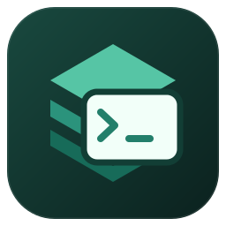

# JumpServer Desktop



面向 JumpServer 社区版的跨平台桌面工作台，提供内嵌终端、SFTP 文件管理和 MySQL 数据库操作。

**这是非官方社区项目，与 JumpServer 官方没有隶属或背书关系。** 当前版本为早期版本；生产部署的 OAuth、组织权限、网关主机密钥与 Chen 行为需要按实际环境验收。

- 项目：<https://github.com/m2eat/JumpServerDesktop>
- 安装包：<https://github.com/m2eat/JumpServerDesktop/releases/latest>
- 问题反馈：<https://github.com/m2eat/JumpServerDesktop/issues>
- 自动构建：<https://github.com/m2eat/JumpServerDesktop/actions>

## 功能

- 系统浏览器 OAuth Authorization Code + PKCE 登录，站点管理、授权资产搜索、类别筛选、收藏及最近连接。
- 通过 JumpServer 返回的原生 SSH 网关连接，内嵌终端、标签与分屏，不启动外部终端；首次连接确认主机密钥。
- 原生 SFTP、本地目录授权、上传／下载、目录上传、后台传输，以及远程文本编辑和未保存内容保护。
- Chen MySQL 资源树、SQL 查询、表格浏览与搜索、精确数值编辑、SQL 预览及逐条确认执行。
- 系统字体选择、终端与编辑器设置、八套主题、简体中文与 English。
- 基于本仓库 GitHub Releases 的稳定版本检查，以及按安装方式提供的下载／安装入口。

### 重要边界

- Core OAuth 令牌不作为 SSH 密码，也不发送到 Chen。SSH 仅使用 Core 授权后返回的连接令牌和网关地址。
- 数据库写操作通过 Chen 的 SQL 通道执行，不直连生产 MySQL。仅已验证的 InnoDB 基础表允许对应编辑操作；无主键表只允许新增。
- 批量 SQL 修改不是跨行原子事务；提交响应丢失时保留“结果未知”，不会自动重试写操作。
- SFTP 协议不提供原子 compare-and-swap 或 no-follow。文件保存前重读校验不能消除服务端并发替换竞态。
- 不提供跨重启传输续传、远端目录复制或客户端内审批／人脸挑战；最终权限和审计能力由服务器决定。

## 下载与安装

每个稳定版本发布以下安装包；文件名包含版本、平台和 CPU 架构：

| 系统 | 架构 | 安装包 | 更新方式 |
| --- | --- | --- | --- |
| Windows | x64 | NSIS `.exe` | 应用内检查、下载，确认后重启安装 |
| Linux | x64 | `.AppImage` | 从 AppImage 启动时支持应用内下载与安装 |
| Linux | x64 | `.deb` | 从发布页下载新版，使用系统包管理器安装 |
| macOS | Apple Silicon arm64、Intel x64 | `.dmg`、`.zip` | 检查版本后从发布页下载，手动替换应用 |

**当前产物未配置发行者代码签名，macOS 也未公证。** Windows SmartScreen 或 macOS Gatekeeper 可能提示未知发行者／阻止启动。请核对下载来源和校验值，再根据组织的安全策略处理；本项目不会关闭系统保护、禁用 Electron sandbox 或绕过签名校验。需要受信发行者签名的组织不应直接部署这些未签名包。

Windows 运行安装程序；macOS 按 CPU 架构选择 DMG，将应用复制到 Applications。Linux AppImage 首次使用需要赋予执行权限：

```sh
chmod +x jumpserver-desktop-*.AppImage
```

AppImage 需要系统 FUSE 支持；不能使用 FUSE 时可选择 `.deb`。Linux 桌面还需要可用的系统钥匙环（如 GNOME Keyring 或 KWallet）；不接受 `basic_text` 明文后端。没有安全存储时会明确报告凭据保存不可用，不静默降低安全级别。字体枚举需要系统字体服务，Linux 通常由 fontconfig 提供。

系统要求以 [Electron 44.3.0 支持范围](https://github.com/electron/electron/blob/v44.3.0/README.md#platform-support) 为准：Windows 10 及以上、macOS 13 Ventura 及以上，Linux 使用仍受 Chromium 与发行版维护者支持的版本。建议优先使用仍受厂商安全维护的系统；不支持 Windows 7／8、32 位 Windows 或无图形桌面的运行环境。

### 校验下载

发布页同时提供 `SHA256SUMS`。将它与下载的安装包放在同一目录，核对对应文件的 SHA-256：

```sh
# Linux；只下载部分文件时核对对应的一行
sha256sum jumpserver-desktop-*.AppImage

# macOS
shasum -a 256 jumpserver-desktop-*.dmg
```

Windows PowerShell：

```powershell
Get-FileHash .\jumpserver-desktop-*.exe -Algorithm SHA256
```

校验和可检测下载损坏，但不能替代发行者签名；安装包和校验文件都必须来自可信发布页。

## 连接 JumpServer

1. 添加站点，填写完整 **HTTPS** 地址。网关子路径可保留；不要在 URL 中填写账号、密码或令牌。
2. 点击登录，在系统浏览器完成站点 OAuth 认证。
3. 浏览器通过 `jms://auth/callback` 返回桌面应用。如果其他 JumpServer 客户端占用了 `jms` 协议，应用会先确认是否接管。
4. 选择授权资产、账号和服务器启用的连接方式。首次原生 SSH 连接请独立核验网关主机密钥指纹。

站点必须开放对应 Core OAuth / API、SSH 网关及 Chen 能力。客户端不会绕过资产授权、组织隔离、SSO、MFA 或服务端审批。Linux 应通过安装包进行桌面／协议注册；直接运行解包目录不等价于完整安装。

终端空闲超时或连接断开后，可点击底部的 **重新连接**。应用使用原资产、账号与连接方式重新走授权流程，在新标签页建立会话；旧标签保留终端输出，不恢复原 shell，也不重放历史输入。连接期间按钮不可重复点击，失败后可再次尝试；不会自动重连以规避服务端空闲超时策略。

## 应用更新

打开 **设置 → 关于与更新**：

- “检查更新”只检查本仓库正式发布的稳定版本，开发环境不访问更新服务。
- Windows NSIS 和 Linux AppImage 用户选择“下载更新”，下载完成后再选择“重启并安装”。
- 不自动下载，不在普通退出时偷偷安装；安装前要求确认，活动连接、传输和未保存编辑受退出保护。当前设置有草稿时先保存或恢复。
- macOS 未签名包及 Linux deb 使用“GitHub 发布页”手动下载，不伪称支持自动安装。
- 检查失败、下载失败和进度在界面中显示；离线不会被误报为“已是最新版”。

版本来源是 `package.json` 与匹配的 Git 标签 `vX.Y.Z`，不是运行时执行 `git pull`。安装包不包含 Git，也不依赖用户机器的 GitHub 凭据。更新不改变 JumpServer 的登录、连接或数据库授权规则。

## 本地开发

需要 Git、Node.js **24 LTS** 或更新的兼容版本，以及 **pnpm 11.15.1**。CI 使用 Node.js 24；不要用 npm/yarn 重写 pnpm 锁文件。

```sh
git clone git@github.com:m2eat/JumpServerDesktop.git
cd JumpServerDesktop
npm install --global pnpm@11.15.1
pnpm install --frozen-lockfile
pnpm dev
```

Windows 原生可选模块编译可能需要 Visual Studio C++ Build Tools；macOS 需要 Xcode Command Line Tools；Linux 需要 Python、make 和 C/C++ 编译工具链。`ssh2` 的可选原生加速模块失败不应降低认证或文件安全约束。

```sh
pnpm typecheck       # TypeScript 检查
pnpm test            # 行为回归测试
pnpm build           # 编译 Main / Preload / Renderer
pnpm run pack        # 当前平台可运行目录，不发布
pnpm dist            # 当前平台安装包，不发布
```

请在目标系统的原生环境打包；三平台正式产物由 GitHub Actions 各自的原生 runner 生成。

### 应用图标

采用「层叠工作台」：青绿色等距层叠与前景终端窗口，呼应 JumpServer 的视觉元素，并区分非官方桌面客户端身份。

唯一矢量源文件为 `build/icon.svg`。修改后运行 `pnpm icons`，重新生成 Windows `build/icon.ico`、macOS `build/icon.icns`、运行窗口 `build/icon.png` 和 Linux `build/icons/` 多尺寸 PNG；生成资源应与源文件一并提交，正常构建不要求重新生成图标。

设计候选与选型结论保存在归档分支 [`prototype/icon-study`](https://github.com/m2eat/JumpServerDesktop/tree/prototype/icon-study)，不进入正式应用。图标仅表达项目关联，不代表 JumpServer 官方背书。

开发实例使用独立配置目录和 `out-dev/`，避免与正式应用混用。可用环境变量：

| 变量 | 用途 |
| --- | --- |
| `JMS_DEV_USER_DATA` | 指定开发实例配置目录 |
| `JMS_DEV_PORT` | Renderer 开发服务端口，默认 5173 |
| `JMS_DEBUG_PORT` | 开发验收用 Chromium 调试端口；不要对外开放 |

生产凭据不应写入 `.env`、源码、截图或测试夹具；不要把真实站点配置提交到仓库。

### 目录

```text
apps/desktop/src/main/         Electron 主进程、认证、文件与更新生命周期
apps/desktop/src/preload/      最小化类型化 IPC 桥
apps/desktop/src/renderer/     React 工作台与设置界面
packages/desktop-contract/    跨进程类型、校验和设备设置
packages/adapters-jumpserver/ Core、原生 SSH/SFTP 与 Chen 适配器
scripts/                      开发及 Git 版本发布工具
.github/workflows/            持续集成与多平台发布
sources/reference-manifest.json  上游只读参考版本和许可观察记录
```

`sources/` 下的上游检出不是运行依赖，不上传或打包。`out/`、`out-dev/`、`release/`、本地配置、数据库、日志、证书和私钥均由 `.gitignore` 排除。历史设计文档用于说明决策背景，其中旧验收截图保留在本地 `release/ui-preview/`，不随源码仓库分发。

## GitHub Actions 与发版

日常开发推送 `main` 或提交 Pull Request，运行三平台检查；PR 工作流没有发布写权限。稳定版本由 `vX.Y.Z` 标签触发，且标签必须与 `package.json` 版本完全一致。预发布版本不进入当前稳定通道。

发布下一版本前，先完成代码提交并保持工作区干净：

```sh
pnpm release:version 0.1.4
git push origin main --follow-tags
```

版本脚本校验版本递增和本地 Git 状态，修改版本并创建提交、带注释标签；**不会替你推送**。不要移动已发布的标签或替换同版本二进制；修复使用更高版本号。

发布工作流在各平台构建后汇集安装包、blockmap 和 `latest*.yml` 更新元数据，验证产物完整性并生成 SHA-256 清单。只有全部平台成功后才公开 GitHub Release；失败不会把半套安装包提供给更新客户端。版本对应的完整源码可通过同一 Release 的 GitHub 源码归档获取。

发布使用仓库内置 `GITHUB_TOKEN`，不需要把个人 PAT 放到客户端或仓库。仓库需要启用 Actions；仅发布作业申请 `contents: write`。当前未配置签名密钥，因此首次发布即可构建但不能承诺受信发行者身份。macOS 自动安装需要正式代码签名；详见 [electron-builder v26 更新文档](https://www.electron.build/v26/docs/features/auto-update/)。

若构建失败，先在 Actions 查看具体 runner 日志，修复并验证，不要手工上传缺失校验元数据的安装包来冒充完整发版。已发布版本不可覆盖；未公开的失败草稿只应在确认没有用户消费后清理。

## 安全与隐私

- Renderer 开启 sandbox、contextIsolation，关闭 Node integration；IPC 校验来源与参数，禁止任意导航和窗口打开。
- OAuth 持久化依赖系统安全存储；拒绝 Linux 明文回退。令牌、数据库数据与生产主机信息不用于更新检查。
- 首次 SSH 网关连接及主机密钥变更需要明确确认。无法识别的能力或写入状态失败关闭，不推断成功。
- 报告问题时请移除 access/refresh token、连接令牌、内部地址、账号和 SQL 中的敏感数据。

## 开源许可与第三方项目

Copyright (C) 2026 JumpServer Desktop contributors.

本项目原创代码依据 **GNU General Public License v3.0 or later（GPL-3.0-or-later）** 发布；你可以在遵守该许可证的前提下使用、修改和再分发。程序按现状提供，**不提供任何担保**，包括适销性或特定用途适用性担保。完整条款见 [LICENSE](LICENSE)。分发修改后的应用时，请同时提供对应源码和构建脚本，并保留许可声明。

Electron、React、HeroUI、xterm.js、Monaco、ssh2 等第三方依赖继续遵循各自许可证；本项目许可证不替代它们的许可和版权声明。上游 JumpServer/KoKo/Chen/Client 的参考检出不随应用分发，来源记录见 [reference-manifest.json](sources/reference-manifest.json)。JumpServer 名称及相关商标属于其权利人，开源许可不授予商标权。
