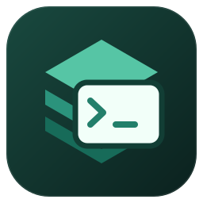
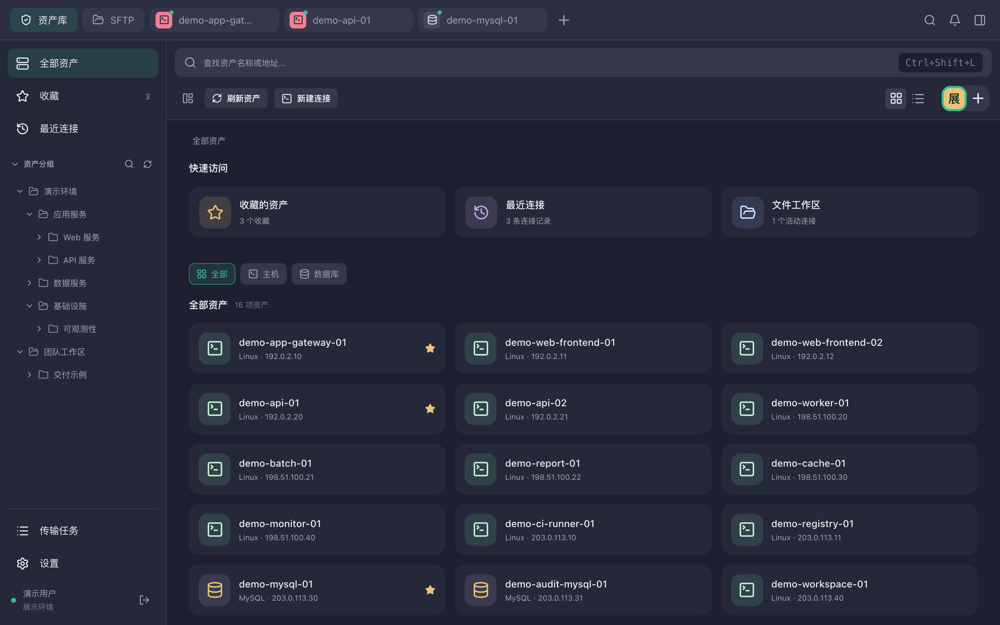
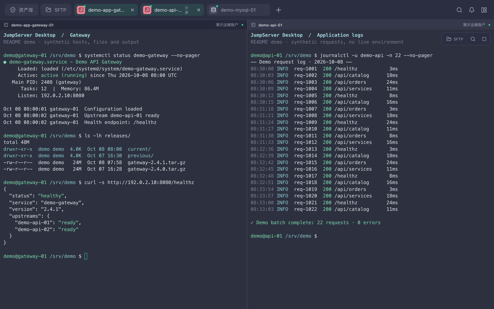
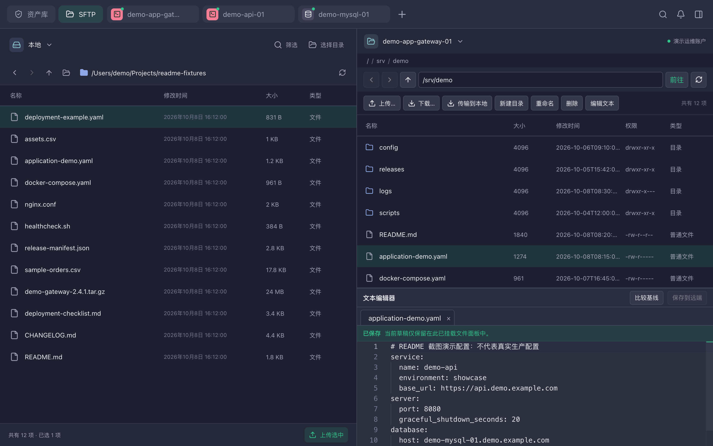
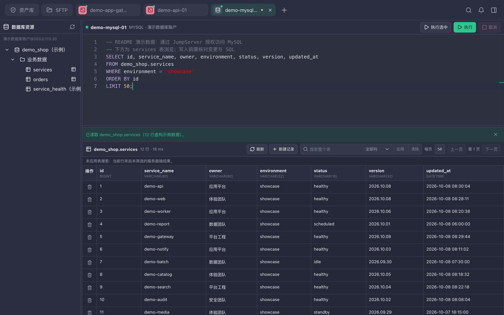
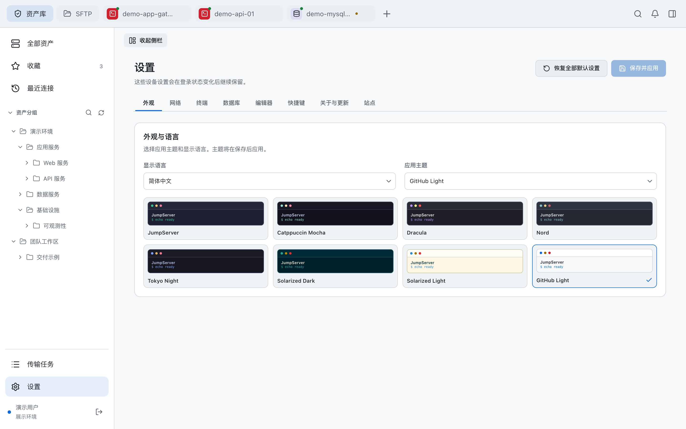

<p align="center">
  
</p>

<h1 align="center">JumpServer Desktop</h1>

<p align="center">
  面向 JumpServer 社区版的跨平台桌面工作台<br>
  <strong>授权资产 · SSH 终端 · SFTP 文件 · MySQL 数据库</strong>
</p>

<p align="center">
  <a href="https://github.com/m2eat/JumpServerDesktop/releases/latest"></a>
  <a href="https://github.com/m2eat/JumpServerDesktop/actions/workflows/ci.yml"></a>
  <a href="LICENSE"></a>
  <a href="#下载与安装"></a>
</p>

<p align="center">
  <a href="https://github.com/m2eat/JumpServerDesktop/releases/latest"><strong>下载最新版本</strong></a> ·
  <a href="#功能">功能一览</a> ·
  <a href="#连接-jumpserver">快速开始</a> ·
  <a href="#使用指南">使用指南</a> ·
  <a href="#本地开发">本地开发</a> ·
  <a href="https://github.com/m2eat/JumpServerDesktop/issues">问题反馈</a>
</p>

> **非官方社区项目**，与 JumpServer 官方没有隶属或背书关系。当前版本为早期版本；生产部署的 OAuth、组织权限、网关主机密钥与 Chen 行为需要按实际环境验收。[安全与使用边界](#安全与隐私)



<p align="center"><sub>从授权资产开始，在同一个工作区切换终端、文件与数据库会话。</sub></p>

**截图说明：** 本页截图来自真实应用的内容区，使用虚构站点、演示身份、文件、终端输出与数据库记录；地址采用文档专用 IP 网段和 `example.com` 域名。截图不包含操作系统窗口按钮，不代表真实 JumpServer 环境联调或生产运行结果。

## 功能

### 授权资产，一处查找

通过系统浏览器完成 OAuth Authorization Code + PKCE 登录，沿用 JumpServer 的资产授权与组织隔离。支持多站点、分层分组、分组范围搜索、类别筛选、收藏、最近连接和全局快速跳转，无需在多个工具间重新查找主机。

### SSH 终端与分屏

- 通过 JumpServer 授权返回的原生 SSH 网关建立内嵌终端，不启动外部终端程序；首次连接确认主机密钥。
- 多标签与双窗格并排工作，支持终端输出搜索、复制粘贴和快捷 SFTP 面板。



### SFTP 文件与远程编辑

- 双栏工作区连接本地授权目录与远端文件，支持上传、下载、目录上传和后台传输。
- 在工作区直接编辑远程文本，比较保存基线；未保存内容、冲突及结果未知状态均有保护。



### MySQL 查询与表格操作

- 通过 Chen 浏览数据库资源树、编辑 SQL、执行查询，并在表格中搜索、分页与刷新。
- 支持精确数值编辑；待提交的新增、修改、删除先进入变更核对与 SQL 预览，再明确确认执行，不直连生产 MySQL。



### 按习惯配置工作台

- 八套主题、跟随系统深浅色、简体中文与 English；终端和编辑器支持系统字体及独立显示设置。
- 46 项可配置快捷键，按操作系统保存；网络代理、站点和应用更新集中管理。
- Windows、macOS、Linux 统一标签栏布局，并保留各平台原生窗口控制。



## 下载与安装

从 **[GitHub Releases 下载最新正式版](https://github.com/m2eat/JumpServerDesktop/releases/latest)**。文件名包含版本、平台和 CPU 架构：

| 系统 | 架构 | 安装包 | 更新方式 |
| --- | --- | --- | --- |
| Windows | x64 | NSIS `.exe` | 自动检查、可选自动下载，确认后重启安装 |
| Linux | x64 | `.AppImage` | 从 AppImage 启动时支持自动检查、可选自动下载与确认安装 |
| Linux | x64 | `.deb` | 从发布页下载新版，使用系统包管理器安装 |
| macOS | Apple Silicon arm64、Intel x64 | `.dmg`、`.zip` | 检查版本后从发布页下载，手动替换应用 |

**当前产物未配置发行者代码签名，macOS 也未公证。** Windows SmartScreen 或 macOS Gatekeeper 可能提示未知发行者／阻止启动。请核对下载来源和校验值，再根据组织的安全策略处理；应用不会自行修改系统信任策略、关闭全局 Gatekeeper 或禁用 Electron sandbox。需要受信发行者签名的组织不应直接部署这些未签名包。

Windows 运行安装程序；macOS 按 CPU 架构选择 DMG，将应用复制到 Applications。Linux AppImage 首次使用需要赋予执行权限：

```sh
chmod +x jumpserver-desktop-*.AppImage
```

AppImage 需要系统 FUSE 支持；不能使用 FUSE 时可选择 `.deb`。Linux 桌面还需要可用的系统钥匙环（如 GNOME Keyring 或 KWallet）；不接受 `basic_text` 明文后端。没有安全存储时会明确报告凭据保存不可用，不静默降低安全级别。字体枚举需要系统字体服务，Linux 通常由 fontconfig 提供。

系统要求以 [Electron 44.3.0 支持范围](https://github.com/electron/electron/blob/v44.3.0/README.md#platform-support) 为准：Windows 10 及以上、macOS 13 Ventura 及以上，Linux 使用仍受 Chromium 与发行版维护者支持的版本。建议优先使用仍受厂商安全维护的系统；不支持 Windows 7／8、32 位 Windows 或无图形桌面的运行环境。

### 校验下载

<details>
<summary>查看 SHA-256 校验命令</summary>

发布页同时提供 `SHA256SUMS`。将它与下载的安装包放在同一目录，核对对应文件的 SHA-256：

```sh
# Linux；只下载部分文件时核对对应的一行
sha256sum jumpserver-desktop-*.AppImage

# macOS
shasum -a 256 jumpserver-desktop-*.dmg
```

Windows PowerShell：

```powershell
Get-FileHash .\jumpserver-desktop-*.exe -Algorithm SHA256
```

校验和可检测下载损坏，但不能替代发行者签名；安装包和校验文件都必须来自可信发布页。

</details>

### macOS 手动安装与隔离提示 / Manual installation and quarantine

<details>
<summary>查看手动安装说明与 Gatekeeper 隔离提示</summary>

macOS 目前不能在应用内自动安装更新。按 CPU 架构下载新版，退出应用后将其复制到 `/Applications`，手动替换旧版本。

若确认安装包与 `SHA256SUMS` 均来自本仓库正式发布页、校验值一致，且复制后仍因隔离属性被 macOS 拦截，可在终端**手动**运行以下命令（工具名是 `xattr`，不是 `xttr`）：

```sh
xattr -dr com.apple.quarantine "/Applications/JumpServer Desktop.app"
```

此操作仅移除该应用及其内部文件的隔离属性，**不等于获得 Apple 信任，也不会完成签名或公证**。不要对整个 `/Applications` 或下载目录执行，不要关闭全局 Gatekeeper。若提示权限不足，先检查安装位置与文件权限，不要直接改用 `sudo`。组织策略禁止未签名应用时，请停止安装并联系管理员。设置页也提供相同提示和“复制命令”，不会执行此命令。

**English:** macOS updates currently require a manual download and replacement in `/Applications` after quitting the app. Only use the command above if the installer and `SHA256SUMS` come from this repository’s official release page, the checksum matches, and macOS still blocks the copied app because of quarantine. It removes quarantine only from this app and its contents; it does not sign, notarize, or make the app Apple-trusted. Never target the whole Applications/downloads directory or disable Gatekeeper globally. Resolve permission errors before considering elevated privileges, and follow your organization’s policy. The app only displays/copies the command; it never executes it.

</details>

## 连接 JumpServer

1. 添加站点，填写完整 **HTTPS** 地址。网关子路径可保留；不要在 URL 中填写账号、密码或令牌。
2. 点击登录，在系统浏览器完成站点 OAuth 认证。
3. 浏览器通过 `jms://auth/callback` 返回桌面应用。如果其他 JumpServer 客户端占用了 `jms` 协议，应用会先确认是否接管。
4. 选择授权资产、账号和服务器启用的连接方式。首次原生 SSH 连接请独立核验网关主机密钥指纹。

站点必须开放对应 Core OAuth / API、SSH 网关及 Chen 能力。客户端不会绕过资产授权、组织隔离、SSO、MFA 或服务端审批。Linux 应通过安装包进行桌面／协议注册；直接运行解包目录不等价于完整安装。

## 使用指南

按需展开操作说明；权限、写入和传输限制见[安全与隐私](#安全与隐私)。

<details>
<summary><strong>连接恢复与会话保护</strong></summary>

终端空闲超时或连接断开后，可点击底部的 **重新连接**。应用使用原资产、账号与连接方式重新走授权流程，在新标签页建立会话；旧标签保留终端输出，不恢复原 shell，也不重放历史输入。连接期间按钮不可重复点击，失败后可再次尝试；不会自动重连以规避服务端空闲超时策略。

SFTP 文件会话检测到 SSH／SFTP 通道断开或请求返回连接丢失时，会在当前操作结束后自动尝试一次重新授权并建立连接，保留原工作区、目录和本地编辑草稿；目录列表和文本读取最多自动重试一次。已完成的传输状态不会因后续断线改变；中断的传输不会自动续传，上传、保存、删除等写操作不会自动重放，未收到写入确认时仍需核验远端结果。重新授权失败后停止自动尝试，可通过文件工作区的“选择主机”重新建立连接；主动关闭会话或退出登录后不会恢复旧连接。

</details>

<details>
<summary><strong>资产分组、搜索与收藏</strong></summary>

### 按资产分组浏览

- 左侧分组沿用 JumpServer 的授权节点层级；点击箭头展开子分组，点击名称查看该分组及所有子分组中可访问的资产。桌面端不修改服务器分组。
- 资产搜索和类型筛选作用于当前分组；“搜索全部资产”保留关键词和类型并移除分组限制，“全部资产”导航则重置筛选。收藏是独立视图，不继承分组限制。
- 分组区的搜索按名称或完整路径查找，包括尚未展开的节点；面包屑可以返回祖先分组。侧栏支持拖动调宽、键盘调整和收起。
- 分组展开状态和上次选中节点按站点、用户、组织隔离保存；恢复时重新验证权限。分组失效会提示并返回全部资产，接口失败会显示错误和重试入口，不会被当作空分组。
- 分组只影响资产浏览，不改变连接授权；切换分组关闭旧资产详情，但不会中断已经打开的会话。

</details>

<details>
<summary><strong>表格编辑、变更核对与刷新</strong></summary>

### 表格编辑与刷新

- 表格工具栏的 **刷新** 重新读取当前表，保留已应用搜索、页码和每页条数；存在未保存修改时，需要先确认放弃修改。
- **新建记录** 在表格内添加待保存行；编辑不会立即写入数据库。底部变更栏的 **查看并保存更改** 打开可展开的底部 Sheet，先核对字段差异，按需查看 SQL，再明确确认执行。
- 单元格的编辑、复制按钮在悬停或键盘聚焦时显示；只读单元格也可通过 Tab 聚焦并复制。表格按行隔离渲染，搜索输入和提示变化不会重绘未变化的行。
- 更新只校验完整主键和本次写入字段的原值：其他字段的并发变化不会阻止保存，也不会被覆盖；同一字段发生变化仍会拒绝提交。删除继续校验整行原值，避免删除已被他人修改的记录。
- 关闭 Sheet 或按 Escape 不会丢失修改和提交报告；提交过程中禁止重复提交。报告可通过底栏重新打开。
- 提交成功但刷新失败时，**重试刷新** 只重新读取，不重复写入。失败后的编辑保护只有在明确放弃修改并成功重新读取后才解除；提交结果未知时仍需重新连接并核验数据库，不能直接重试。

</details>

<details>
<summary><strong>网络代理</strong></summary>

### 网络代理

打开 **设置 → 网络**，选择 **使用系统代理**（默认）、**直接连接（禁用代理）** 或 **自定义代理**，然后点击 **保存并应用**。未登录时也能修改；设置保存在本机，旧配置自动沿用系统代理。

- 自定义代理使用单个带端口的地址，例如 `http://127.0.0.1:7897`、`https://proxy.example.com:443` 或 `socks5://127.0.0.1:1080`；不支持在地址里保存账号、密码或指定路径。
- “不使用代理的地址”接受逗号分隔的 Chromium 绕过规则，例如 `localhost,127.0.0.1,*.internal.example.com`。仅自定义模式使用此列表；切换模式保留自定义地址和规则。
- 保存后无需重启：后续 OAuth 登录、Core 请求和新建 Chen HTTP/WebSocket 连接使用新路由。现有 Chen 连接需重新连接；正在进行的更新下载不会被主动中断。
- 应用内更新请求也使用此设置。系统浏览器与原生 SSH/SFTP 不受影响，操作系统的代理配置不会被修改。
- 自定义代理不可用会报错，不会自动回退直连。若系统代理阻断内网站点，可选择直连后重新登录，不必清除已保存的登录凭据。

**English:** Choose System, Direct, or Custom under **Settings → Network**. Settings persist on this device and are available before login. Custom HTTP/HTTPS/SOCKS5 proxies require an explicit port and cannot contain credentials; optional bypass rules are comma-separated. Saved changes apply to subsequent login/API requests and new Chen connections without restarting. Reconnect existing Chen sessions to change their route. Native SSH/SFTP and the system browser are unaffected. An unavailable custom proxy never silently falls back to direct access.

</details>

<details>
<summary><strong>窗口与外观</strong></summary>

### 窗口与外观

- 三个平台都将窗口控制与顶部标签栏放在同一行。macOS 保留左侧红黄绿按钮；Windows／Linux 隐藏独立系统标题栏，使用 Electron 原生窗口按钮覆盖层，不以网页按钮替代最小化、最大化／还原和关闭。
- Windows／Linux 的按钮区域随应用主题配色，并按系统报告的位置为标签和工具按钮留出空间，兼容 Linux 将窗口按钮放在左侧的布局。选择“跟随系统”时，窗口按钮配色也会随深浅色切换。
- 顶部空白区域可拖动窗口，加载中或初始化失败时也保留顶部拖动区域。关闭窗口仍经过未保存编辑、活动连接和传输任务的原有确认流程。
- Windows／Linux 默认自动隐藏应用菜单栏，可按 `Alt` 显示菜单。

**English:** The tab strip shares a single row with native window controls on all platforms. macOS keeps its traffic lights; Windows/Linux use Electron's window-controls overlay, matching the application theme and reserving space on either side according to the desktop layout. The empty top strip remains draggable, including during startup or initialization errors. Existing close confirmations remain in place. On Windows/Linux, press `Alt` to reveal the auto-hidden application menu.

</details>

<details>
<summary><strong>键盘快捷键</strong></summary>

### 键盘快捷键

设置按「外观、网络、终端、数据库、编辑器、快捷键、关于与更新、站点」分类显示。标签栏和保存按钮保持可见，只有当前类别内容滚动；切换标签保留所有未保存修改，**保存并应用**统一保存各类别草稿。快捷键入口和更新入口直接打开对应标签。

打开 **设置 → 快捷键**，可搜索全部 46 项应用动作，录制新组合键、解绑、恢复单项或整个平台的默认值。每个按键显示为独立键帽：macOS 使用 ⌘、⌥、⇧、⌃ 等符号，Windows 使用 Ctrl、Alt、Shift 等文字。macOS、Windows、Linux 的覆盖配置独立保存为设备设置，不随登录身份变化；旧版本设置会自动补齐默认键位。

| 常用动作 | macOS | Windows |
| --- | --- | --- |
| 全局搜索／命令 | `⌘K` | `Ctrl+Shift+K` |
| 新建／关闭当前连接标签 | `⌘T` / `⌘W` | `Ctrl+Shift+T` / `Ctrl+Shift+W` |
| 下一个／上一个标签 | `Ctrl+Tab` / `Ctrl+Shift+Tab` | 同左 |
| 第 1–8 个／最后一个连接标签 | `⌘1…8` / `⌘9` | `Alt+1…8` / `Alt+9` |
| 设置／快捷键设置 | `⌘,` / `⇧⌘,` | `Ctrl+,` / `Ctrl+Shift+,` |
| 终端搜索 | `⌘F` | `Ctrl+Shift+F` |
| 终端复制／粘贴 | `⌘C` / `⌘V` | `Ctrl+Shift+C` / `Ctrl+Shift+V` |
| 保存远程文件 | `⌘S` | `Ctrl+S` |
| 执行选中 SQL（未选中时执行全文） | `⌘Enter` | `Ctrl+Enter` |
| 刷新远端目录／当前表格 | `F5` | `F5` |

- 快捷键只在应用获得焦点时工作，不注册系统全局热键。终端、文件、SQL 编辑器和表格按焦点分发；后台窗格不执行动作。弹窗、输入法组合和快捷键录制期间暂停应用动作。
- Windows 终端默认保留 Shell 的 `Ctrl+C`、`Ctrl+V`、`Ctrl+W` 等控制键。可主动改绑，但不建议占用正在使用的 Shell 或编辑器按键。
- 同一作用域、全局与局部、编辑器与文件／数据库的重复绑定会阻止保存；互不相交的作用域允许复用。系统保留组合和无修饰键的普通输入不可绑定；功能键可单独使用。
- 绑定记录物理按键位置，而非输入法产生的字符。原生文本编辑、Tab／方向键导航、Enter／Escape 确认取消仍沿用控件行为；此设置管理应用动作，不替换 Monaco 的完整编辑键位系统。
- 文件保存、关闭连接、数据库变更预览与退出继续经过原有权限和确认流程；快捷键不会直接提交表格写入。

**English:** All 46 application commands can be rebound, cleared or reset under **Settings → Shortcuts**. Overrides are stored separately for macOS, Windows and Linux and take effect after **Save and apply**. Windows terminal defaults use Ctrl+Shift to preserve shell control keys; macOS uses Command. Dispatch follows the focused surface, pauses for modals/IME/recording, and retains existing authorization and confirmation steps. Overlapping bindings and reserved OS combinations block saving. Bindings use physical key positions; native text/navigation controls and Monaco’s full editing keymap remain native.

Settings are grouped into eight tabs with a fixed header and tab bar; only the active panel scrolls. Switching tabs preserves drafts, and **Save and apply** saves all categories together. Shortcuts use individual platform-specific keycaps, and shortcut/update entry points open their corresponding tab directly.

</details>

<details>
<summary><strong>应用更新</strong></summary>

### 应用更新

打开 **设置 → 关于与更新**：

- 默认启用“自动检查更新”：启动并加载设备设置 15 秒后首次检查，之后每轮检查结束 6 小时后再次检查。仅访问本仓库正式稳定版本；开发环境不访问更新服务。
- “自动下载更新”默认关闭。Windows NSIS 和 Linux AppImage 可开启；发现新版后自动下载，或在已有新版时保存该设置立即开始下载。关闭不会取消已开始的下载。
- 两个选项随“保存并应用”持久化为设备设置，不随登录身份变化；关闭自动检查后仍可手动“检查更新”。已有设备设置会保留并补齐新选项。
- 发现新版或下载完成时，窗口顶部显示常驻更新入口，可跳转设置查看版本和发布说明，不打断当前连接。
- 下载完成后必须选择“重启并安装”并确认；不会强制重启或在普通退出时安装。活动连接、传输和未保存编辑受退出保护；当前设置有草稿时须先保存或恢复。
- macOS 未签名包及 Linux deb 可自动检查，但仍通过“查看更新说明”进入发布页手动下载，不提供应用内自动安装。macOS 隔离处理见上方说明。
- 检查失败、下载失败和进度在设置页显示；后台失败不弹出打断工作的通知，离线不误报为“已是最新版”，可以手动重试。

**English:** Automatic checks are enabled by default: the first check runs 15 seconds after startup settings load, then 6 hours after each scheduled check completes. Automatic downloads are opt-in for Windows NSIS and Linux AppImage; disabling the preference does not cancel an active download. Both settings persist across login changes. A persistent update entry opens Settings when a new version is available or downloaded. Installation always requires explicit restart confirmation and never occurs on normal quit. macOS unsigned builds and Linux deb remain manual-install only; background failures remain visible in Settings without interrupting work.

版本来源是 `package.json` 与匹配的 Git 标签 `vX.Y.Z`，不是运行时执行 `git pull`。安装包不包含 Git，也不依赖用户机器的 GitHub 凭据。更新不改变 JumpServer 的登录、连接或数据库授权规则。

</details>

## 本地开发

需要 Git、Node.js **24 LTS** 或更新的兼容版本，以及 **pnpm 11.15.1**。CI 使用 Node.js 24；不要用 npm/yarn 重写 pnpm 锁文件。

```sh
git clone git@github.com:m2eat/JumpServerDesktop.git
cd JumpServerDesktop
npm install --global pnpm@11.15.1
pnpm install --frozen-lockfile
pnpm dev
```

Windows 原生可选模块编译可能需要 Visual Studio C++ Build Tools；macOS 需要 Xcode Command Line Tools；Linux 需要 Python、make 和 C/C++ 编译工具链。`ssh2` 的可选原生加速模块失败不应降低认证或文件安全约束。

```sh
pnpm typecheck       # TypeScript 检查
pnpm test            # 行为回归测试
pnpm build           # 编译 Main / Preload / Renderer
pnpm run pack        # 当前平台可运行目录，不发布
pnpm dist            # 当前平台安装包，不发布
```

请在目标系统的原生环境打包；三平台正式产物由 GitHub Actions 各自的原生 runner 生成。

<details>
<summary><strong>开发目录、配置隔离与图标资源</strong></summary>

### 应用图标

采用「层叠工作台」：青绿色等距层叠与前景终端窗口，呼应 JumpServer 的视觉元素，并区分非官方桌面客户端身份。

唯一矢量源文件为 `build/icon.svg`。修改后运行 `pnpm icons`，重新生成 Windows `build/icon.ico`、macOS `build/icon.icns`、运行窗口 `build/icon.png` 和 Linux `build/icons/` 多尺寸 PNG；生成资源应与源文件一并提交，正常构建不要求重新生成图标。

设计候选与选型结论保存在归档分支 [`prototype/icon-study`](https://github.com/m2eat/JumpServerDesktop/tree/prototype/icon-study)，不进入正式应用。图标仅表达项目关联，不代表 JumpServer 官方背书。

开发实例使用独立配置目录和 `out-dev/`，避免与正式应用混用。可用环境变量：

| 变量 | 用途 |
| --- | --- |
| `JMS_DEV_USER_DATA` | 指定开发实例配置目录 |
| `JMS_DEV_PORT` | Renderer 开发服务端口，默认 5173 |
| `JMS_DEBUG_PORT` | 开发验收用 Chromium 调试端口；不要对外开放 |

生产凭据不应写入 `.env`、源码、截图或测试夹具；不要把真实站点配置提交到仓库。

### 目录

```text
apps/desktop/src/main/         Electron 主进程、认证、文件与更新生命周期
apps/desktop/src/preload/      最小化类型化 IPC 桥
apps/desktop/src/renderer/     React 工作台与设置界面
packages/desktop-contract/    跨进程类型、校验和设备设置
packages/adapters-jumpserver/ Core、原生 SSH/SFTP 与 Chen 适配器
scripts/                      开发及 Git 版本发布工具
.github/workflows/            持续集成与多平台发布
docs/images/                  README 功能截图（虚构演示数据）
sources/reference-manifest.json  上游只读参考版本和许可观察记录
```

`sources/` 下的上游检出不是运行依赖，不上传或打包。`out/`、`out-dev/`、`release/`、本地配置、数据库、日志、证书和私钥均由 `.gitignore` 排除。历史设计文档用于说明决策背景，其中旧验收截图保留在本地 `release/ui-preview/`，不随源码仓库分发。

</details>

<details>
<summary><strong>GitHub Actions 与发版流程</strong></summary>

### GitHub Actions 与发版

日常开发推送 `main` 或提交 Pull Request，运行三平台检查；PR 工作流没有发布写权限。稳定版本由 `vX.Y.Z` 标签触发，且标签必须与 `package.json` 版本完全一致。预发布版本不进入当前稳定通道。

发布下一版本前，先完成代码提交并保持工作区干净。下面以 `0.1.10` 为例，实际版本必须高于当前 `package.json` 版本：

```sh
pnpm release:version 0.1.10
git push origin main --follow-tags
```

版本脚本校验版本递增和本地 Git 状态，修改版本并创建提交、带注释标签；**不会替你推送**。不要移动已发布的标签或替换同版本二进制；修复使用更高版本号。

发布工作流在各平台构建后汇集安装包、blockmap 和 `latest*.yml` 更新元数据，验证产物完整性并生成 SHA-256 清单。只有全部平台成功后才公开 GitHub Release；失败不会把半套安装包提供给更新客户端。版本对应的完整源码可通过同一 Release 的 GitHub 源码归档获取。

发布使用仓库内置 `GITHUB_TOKEN`，不需要把个人 PAT 放到客户端或仓库。仓库需要启用 Actions；仅发布作业申请 `contents: write`。当前未配置签名密钥，因此首次发布即可构建但不能承诺受信发行者身份。macOS 自动安装需要正式代码签名；详见 [electron-builder v26 更新文档](https://www.electron.build/v26/docs/features/auto-update/)。

若构建失败，先在 Actions 查看具体 runner 日志，修复并验证，不要手工上传缺失校验元数据的安装包来冒充完整发版。已发布版本不可覆盖；未公开的失败草稿只应在确认没有用户消费后清理。

</details>

## 安全与隐私

### 重要边界

- Core OAuth 令牌不作为 SSH 密码，也不发送到 Chen。SSH 仅使用 Core 授权后返回的连接令牌和网关地址。
- 数据库写操作通过 Chen 的 SQL 通道执行，不直连生产 MySQL。仅已验证的 InnoDB 基础表允许对应编辑操作；无主键表只允许新增。
- 批量 SQL 修改不是跨行原子事务；提交响应丢失时保留“结果未知”，不会自动重试写操作。
- SFTP 协议不提供原子 compare-and-swap 或 no-follow。文件保存前重读校验不能消除服务端并发替换竞态。
- 不提供跨重启传输续传、远端目录复制或客户端内审批／人脸挑战；最终权限和审计能力由服务器决定。

### 实现与隐私

- Renderer 开启 sandbox、contextIsolation，关闭 Node integration；IPC 校验来源与参数，禁止任意导航和窗口打开。
- OAuth 持久化依赖系统安全存储；拒绝 Linux 明文回退。令牌、数据库数据与生产主机信息不用于更新检查。
- 首次 SSH 网关连接及主机密钥变更需要明确确认。无法识别的能力或写入状态失败关闭，不推断成功。
- 报告问题时请移除 access/refresh token、连接令牌、内部地址、账号和 SQL 中的敏感数据。

## 参与贡献

欢迎通过 [Issues](https://github.com/m2eat/JumpServerDesktop/issues) 报告问题、提出功能建议，或提交 [Pull Request](https://github.com/m2eat/JumpServerDesktop/pulls) 改进代码、文档与翻译。

- 问题报告请注明应用版本、操作系统、JumpServer 部署版本及复现步骤，并先移除敏感信息。
- 代码贡献请先阅读[本地开发](#本地开发)，运行类型检查、相关行为测试，并实际验证受影响的界面或连接路径。
- 文档截图请只使用虚构数据，不提交真实站点、账号、令牌或生产业务记录。

## 开源许可与第三方项目

Copyright (C) 2026 JumpServer Desktop contributors.

本项目原创代码依据 **GNU General Public License v3.0 or later（GPL-3.0-or-later）** 发布；你可以在遵守该许可证的前提下使用、修改和再分发。程序按现状提供，**不提供任何担保**，包括适销性或特定用途适用性担保。完整条款见 [LICENSE](LICENSE)。分发修改后的应用时，请同时提供对应源码和构建脚本，并保留许可声明。

Electron、React、HeroUI、xterm.js、Monaco、ssh2 等第三方依赖继续遵循各自许可证；本项目许可证不替代它们的许可和版权声明。上游 JumpServer/KoKo/Chen/Client 的参考检出不随应用分发，来源记录见 [reference-manifest.json](sources/reference-manifest.json)。JumpServer 名称及相关商标属于其权利人，开源许可不授予商标权。
